# DEMO_CHECKLIST.md — BNWEMS Web Frontend (chế độ demo mock data)

> Checklist theo dõi tiến độ chuẩn bị bản demo frontend chạy hoàn toàn bằng mock data trên
> localhost, không cần backend thật (`D:\bnwems-backend-api` không cần chạy). Cập nhật file này
> (tick `[x]`, thêm ghi chú) mỗi khi hoàn thành 1 task để cả nhóm theo dõi tiến độ chung.

## 0. Bối cảnh dự án (kết quả quét thư mục — không sửa gì ở bước này)

- Next.js 16 (App Router) + TypeScript + TailwindCSS v4, dev server chạy `npm run dev` → `http://localhost:3000`.
- `src/app/`: 58 trang `admin/`, 25 trang `manager/`, 2 trang `auth/` (login, forgot-password).
- `src/mocks/`: đã có sẵn rất nhiều file mock tĩnh (catalogMocks, adminOrdersMock, adminCustomersMock, adminDashboard, managerDashboard, authAccounts...) — phần lớn trang (~53/86) đọc thẳng từ đây, KHÔNG qua `services/`.
- `src/services/*.service.ts`: 25 file, là lớp gọi API chuẩn (bắt buộc theo CLAUDE.md mục 4, không được gọi axios trực tiếp trong component).
- `src/services/api.ts` + `src/services/mockAdapter.ts` (mới): lớp mock-adapter chặn toàn bộ axios request khi `NEXT_PUBLIC_MOCK_MODE=true` (`.env.local`), trả dữ liệu giả thay vì gọi backend thật. Đây là cơ chế demo chính — xem chi tiết Task 1.
- 2 tài khoản demo có sẵn (`src/mocks/authAccounts.ts`): `admin`/`Admin@123`, `manager`/`Manager@123`.

## 1. Checklist tiến độ

### Đã hoàn thành

- [X]  Sửa lại đúng ngày không để mặc định!

  
- [X]  khi bắt đầu chạy đang auto đăng nhập trước vào manager
  **Nguyên nhân**: `src/app/auth/login/page.tsx` có `useEffect` tự động điều hướng sang dashboard nếu phát hiện đã có phiên đăng nhập lưu trong `localStorage` (từ lần đăng nhập trước) — mở lại `/` hoặc `/auth/login` sẽ tự nhảy thẳng vào Manager/Admin dashboard, không hiện form đăng nhập.
  **Đã sửa**: xóa hẳn `useEffect` auto-redirect đó — trang login giờ LUÔN hiện form, dù còn phiên cũ hay không, theo đúng yêu cầu. `ProtectedRoute.tsx` (chặn truy cập trang đã bảo vệ khi CHƯA đăng nhập) giữ nguyên, không liên quan.
  Đã kiểm tra: `npx tsc --noEmit` sạch; test Playwright — đăng nhập Manager xong, mở lại `/auth/login` và `/` đều hiện đúng form đăng nhập thay vì tự chuyển hướng. 0 lỗi console.
- [X]  Đổi tên sao cho phù hợp

  
- [X]  Chưa kế thừa dữ liệu (hiển thị ở lựa chọn đơn đặt hàng)

  
  **Đã sửa** (`src/components/planning/PlanFormDrawer.tsx`, drawer "Lập kế hoạch điều phối mới" dùng chung Admin/Manager): đổi tên "Section 1: Thông tin đơn đặt hàng" → "Section 1: Thông tin đơn hàng/ báo giá" và nhãn ô chọn "Lựa chọn đơn đặt hàng" → "Lựa chọn đơn đặt/ báo giá" cho khớp đúng nội dung — ô này vốn đã gộp cả `getUnplannedOrders()` và `getUnplannedQuotations()` vào cùng 1 ô tìm kiếm, chỉ có tên nhãn cũ chưa phản ánh đúng là ô này liên kết cả 2 loại dữ liệu.
  **Phát hiện thêm sau khi test lại** (người dùng đối chiếu trực tiếp với trang "Quản lý báo giá"): nội dung ô search trong drawer vẫn khác trang danh sách báo giá thật — vì `getUnplannedQuotations()`/`getUnplannedOrders()` (`src/mocks/db/schedulePlans.ts`) đang lọc cứng theo trạng thái (`draft`/`surveying` cho báo giá, `CONFIRMED`/`IN_PROGRESS` cho đơn) trước khi đưa vào ô tìm kiếm, nên phần lớn báo giá `approved`/`rejected` (72/125 báo giá theo KPI trang Quản lý báo giá) không bao giờ xuất hiện được trong drawer dù có trong bảng danh sách chính.
  **Đã sửa tiếp**: bỏ điều kiện lọc theo trạng thái ở cả 2 hàm — giờ liệt kê TOÀN BỘ đơn đặt và TOÀN BỘ báo giá (mọi trạng thái, đúng khớp nội dung trang "Danh sách đơn đặt"/"Quản lý báo giá"), chỉ còn loại trừ đơn/báo giá đã gắn kế hoạch khác (tránh tạo trùng kế hoạch cho cùng 1 đối tượng).
  Đã kiểm tra: `npx tsc --noEmit` sạch. Chưa có tool trình duyệt trong phiên này để chụp screenshot xác nhận trực quan — cần người dùng tự mở lại drawer, gõ "BG" và đối chiếu số lượng/mã kết quả với trang "Quản lý báo giá" để xác nhận đã khớp.
- [X]  chưa cập nhật được trạng thái cọc
  
- [X]  Search đc khách hàng

  
- [X]  thu gọn theo mục và có thể search

  
- [X]  danh sách hạng mục thu gọn lại theo thanh lăn
- [X]  khi phân công khảo sát xong phải button " quản lí kế hoạch khảo sát " chuyển thành " đổi lịch phân công" và update kế hoạch lên màn hình
  
- [X]  xóa phần dự kiến

  
- [X]  xóa cột tiến độ chuânr bị

  
- [X]  Đơn hàng chưa có ngày kết thúc

  
- [X]  nội dung màn change request cũng hiện ở icon chuông trên header

  
- [X]  Code  thêm màn policy ở admin
- [X]  ở điều khoản chung trong báo giá liên kết với policy trong admin và view nội dung ra
  **Nguyên nhân**: khối "Chính sách chung:" ở trang chi tiết báo giá (`admin/quotations/[id]`, `manager/quotations/[id]`) trước đây là 2 dòng text hard-code cố định ("Báo giá có hiệu lực trong vòng 30 ngày...", "Tạm ứng trước 50%...") — không đọc từ đâu cả, kể cả sau khi đã có màn `/admin/policies` quản lý chính sách thật (task trước đó).
  **Đã sửa** (cả 2 trang, logic giống hệt nhau): import thẳng `MOCK_POLICIES` (`@/mocks/apiFixtures` — cùng nguồn dữ liệu mà `/admin/policies` đọc/ghi qua `policyApiService`), lọc các chính sách **đang áp dụng** thuộc loại `DEPOSIT`/`CANCELLATION` (2 loại liên quan trực tiếp tới điều khoản báo giá — cọc & hoàn cọc khi hủy; `COMPENSATION`/`FEE`/`WAGE` thuộc giai đoạn thi công/vận hành, không phải điều khoản báo giá nên không đưa vào đây) — hiện mỗi chính sách dạng `• {tên chính sách}: {giá trị}{đơn vị} — {mô tả}` (giá trị luôn hiện tường minh, không chỉ dựa vào câu mô tả, vì mô tả tự do không phải lúc nào cũng nhắc lại đúng con số — vd chính sách "Tỉ lệ đặt cọc tiêu chuẩn" có mô tả không hề chứa số %). Dòng "hiệu lực báo giá" đổi từ hard-code "30 ngày" sang hiện đúng ngày hết hạn thật `row.validUntil` của từng báo giá.
  File đã sửa: `src/app/admin/quotations/[id]/page.tsx`, `src/app/manager/quotations/[id]/page.tsx`.
  Đã kiểm tra: `npx tsc --noEmit` sạch; test bằng Playwright (đăng nhập Admin, **điều hướng bằng click thật trong app** — không dùng `page.goto()` giữa các bước vì phát hiện `MOCK_POLICIES` là mảng in-memory thuần như `schedulePlans.ts`, reload cứng sẽ mất thay đổi vừa sửa, không phải lỗi của tính năng) — mở báo giá `bg-1` thấy đúng 4 chính sách thật (3 mốc hoàn cọc + tỉ lệ cọc chuẩn) kèm ngày hết hạn thật; sang `/admin/policies` sửa "Tỉ lệ đặt cọc tiêu chuẩn" từ 50% → 60% → quay lại đúng báo giá `bg-1` bằng điều hướng trong app → **giá trị trên báo giá cập nhật ngay thành 60%**, chứng minh liên kết dữ liệu thật (không phải 2 nguồn tách rời). Đối chiếu thêm phía Manager (`manager/quotations/bg-1`) hiển thị đúng. 0 lỗi console.

  
- [X]  đây phải là tiến trình của báo giá, search đc báo giá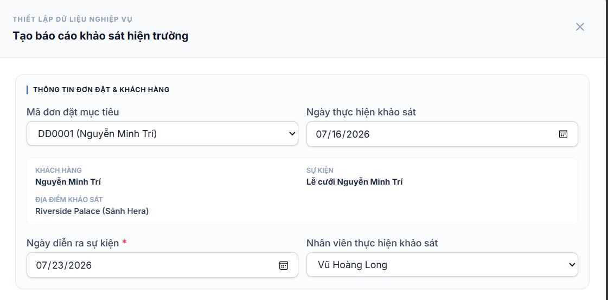
- [X]  xóa tiến độ sắp xếp kho vật tư. Ở mỗi đầu việc sẽ update giờ bắt đầu làm, giờ hoàn thành thực tế theo leader staff cập nhật

  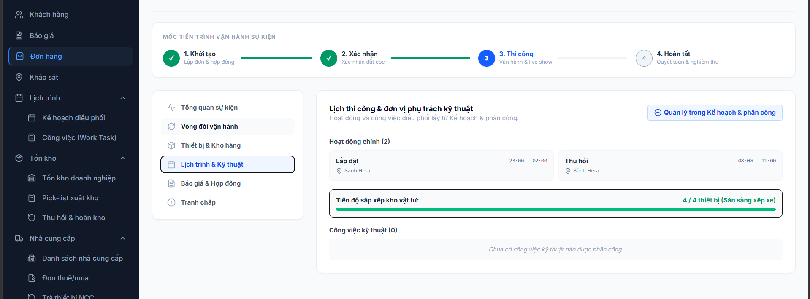
  **Đã sửa**: xóa khối "Tiến độ sắp xếp kho vật tư" (thanh % + progress bar) khỏi tab "Lịch trình & Kỹ thuật" ở trang chi tiết đơn (`src/app/admin/orders_audit/[id]/page.tsx`, `src/app/manager/orders/[id]/page.tsx`) — chỉ xóa đúng bản trong tab này, giữ nguyên khối tương tự ở Mốc 3 (tab "Tiến độ sự kiện") vì không thuộc phạm vi yêu cầu. Phần "giờ bắt đầu làm/giờ hoàn thành thực tế theo Leader Staff cập nhật" ở mỗi công việc kỹ thuật bên dưới (`task.actualStartTime`/`task.actualEndTime`) đã có sẵn từ trước, không cần thêm.
  Đã kiểm tra: `npx tsc --noEmit` và `eslint` sạch. Chưa có tool trình duyệt trong phiên này để chụp screenshot xác nhận trực quan.
- [X]  Liên kết dữ liệu với mock data, khi click vào thì ra màn của nội dung đấy

  
  **Nguyên nhân**: 4 thẻ KPI ở "Tổng quan" Admin (Doanh thu tháng/Đơn đặt mới/Báo giá chờ duyệt/Khách hàng mới) đã tính đúng số liệu thật từ mock data, nhưng thẻ chỉ là `<div>` tĩnh — bấm vào không có phản ứng gì, không dẫn tới màn danh sách tương ứng.
  **Đã sửa**: thêm field `href?: string` vào `KpiCardItem` (`src/components/reports/DashboardStats.tsx`, component KPI dùng chung toàn site) — có `href` thì thẻ tự bọc trong `<Link>` (bấm được, có hover shadow), không có thì giữ nguyên `<div>` tĩnh như cũ (không phá vỡ các nơi khác đang dùng component này mà chưa cần link, vd trang Pick-list xuất kho). Gắn `href` cho từng thẻ:

  - Admin (`admin/dashboard/page.tsx`): Doanh thu tháng → `/admin/reports/revenue`, Đơn đặt mới → `/admin/orders_audit`, Báo giá chờ duyệt → `/admin/quotations`, Khách hàng mới → `/admin/customers`.
  - Manager (`manager/dashboard/page.tsx`, cùng component dùng chung nên sửa luôn cho nhất quán): Đơn đang xử lý → `/manager/orders`, Việc cần làm hôm nay → `/manager/schedule/tasks`, Cảnh báo tồn kho → `/manager/inventory/stock-check`. Riêng "Chờ xác nhận" **không gắn link** — danh sách chi tiết của đúng số liệu này đã hiện sẵn ngay bên dưới trên cùng trang (`PendingConfirmationsCard`), gắn thêm link ra trang khác sẽ dư thừa/gây nhầm.
    File đã sửa: `src/components/reports/DashboardStats.tsx`, `src/app/admin/dashboard/page.tsx`, `src/app/manager/dashboard/page.tsx`.
    Đã kiểm tra: `npx tsc --noEmit` sạch; test bằng Playwright (đăng nhập Admin + Manager riêng biệt, không chỉ đọc code) — xác nhận cả 4 thẻ Admin và 3/4 thẻ Manager có đúng `href` như thiết kế; bấm thật vào thẻ "Đơn đặt mới" → điều hướng đúng sang `/admin/orders_audit`; xác nhận thẻ "Chờ xác nhận" bên Manager **không** phải link (đúng chủ đích). 0 lỗi console.
- [X]  Ở mốc 2, Phải xác nhận 2 công việc là cọc vào khảo sát

  những đơn khi khởi tạo mà khách hàng đặt cọc luôn rồi thì xác nhận luôn là đã cọc, những đơn đc tạo khi đã khảo sát và cọc thì xác nhận luôn mốc 2

  
  **Nguyên nhân**: `isMilestone2Complete` (tab "Tiến độ sự kiện", `manager/orders/[id]/page.tsx`) trước đây chỉ dựa vào `isDeposited` (trạng thái cọc) — khối "Khảo sát hiện trường" trong Mốc 2 vẫn là placeholder in nghiêng "chưa nối API thật" vì tại thời điểm viết (2026-07-20), `work_tasks` chưa seed danh mục "Khảo sát hiện trường". Test lại bằng `curl` ngày 2026-07-21 xác nhận danh mục này **đã được Backend seed** (`TSK-SURVEY`), và `GET /survey-reports` (đã nối cho màn `/manager/survey` trước đó) dùng lại được ngay ở đây.
  **Đã sửa**: Mốc 2 giờ đọc báo cáo khảo sát thật của đúng đơn (`surveyApiService.getSurveyReports({ search: order.orderCode })` rồi lọc chính xác theo `orderId` — `GET /survey-reports` không có param lọc `orderId` thật, test qua `curl` xác nhận bị bỏ qua, chỉ `search` hoạt động) và đổi `isMilestone2Complete = isDeposited && isSurveyDone` (cả cọc `SUCCESS` **và** khảo sát `CONFIRMED`) — đúng yêu cầu: đơn nào cọc/khảo sát đã có sẵn trong dữ liệu thật thì Mốc 2 tự động hiện "Hoàn thành" ngay khi mở trang, không cần bấm lại; đơn nào khảo sát mới `SUBMITTED`/`NEEDS_REVIEW` thì hiện nút "Xác nhận khảo sát" (gọi `PUT /survey-reports/:id/confirm`, cùng hành vi đã dùng ở màn `/manager/survey`).
  File đã sửa: `src/app/manager/orders/[id]/page.tsx` (thêm import `surveyApiService`/`SurveyReportListItem`, state `surveyReport`, tải kèm trong `load()`, hàm `handleConfirmSurvey`, thay khối placeholder Mốc 2). Chưa mirror sang `admin/orders_audit/[id]/page.tsx` — tab "Tiến độ sự kiện" bên Admin đã bị ẩn khỏi thanh điều hướng từ trước (đúng CLAUDE.md: Admin không xác nhận cọc/khảo sát), giữ nguyên placeholder cũ ở nhánh code chết đó thay vì tốn công đồng bộ chỗ không ai truy cập được.
  Đã kiểm tra: `npx tsc --noEmit` sạch; `curl` xác nhận `GET /survey-reports?search=ORD-001` trả đúng `SUR-001` (status `CONFIRMED`) cho đơn `ORD-001` — đơn này đã có sẵn cọc `SUCCESS` + khảo sát `CONFIRMED` nên Mốc 2 phải tự hiện "Hoàn thành" ngay khi tải trang, đúng yêu cầu. `curl` trang `/manager/orders/[id]` xác nhận HTTP 200, không lỗi compile. Chưa có tool trình duyệt trong phiên này để tự bấm nút "Xác nhận khảo sát" trên 1 đơn có khảo sát `NEEDS_REVIEW` (dữ liệu mẫu hiện chỉ có `SUR-001` đã `CONFIRMED` sẵn).
- [X]  Ở mốc 3 có cập nhật trạng thái làm việc ( bắt đầu lúc mấy giờ, hoàn thành lúc mấy giờ) và không có tiến độ sắp xếp kho vật tư

  
  **Rà soát lại**: khối "Tiến độ sắp xếp kho vật tư" (thanh % dựng từ mock cũ) **không còn tồn tại** ở Mốc 3 nữa — đã bị loại bỏ từ lần viết lại toàn bộ tab "Tiến độ sự kiện" theo `docs/tiendosukien_api.md` (2026-07-20, chuyển sang đọc `schedule_plans` thật thay vì mock tiến độ kho). Xác nhận lại bằng grep không còn sót dòng nào liên quan.
  **Đã sửa phần còn thiếu**: mỗi hoạt động kỹ thuật ở Mốc 3 trước đây chỉ hiện `formatDate(plan.startTime)` (chỉ có ngày, không có giờ, không có giờ thực tế) — nay hiện thêm giờ dự kiến đầy đủ (`formatTime(plan.startTime)` - `formatTime(plan.endTime)`) và **giờ thực tế theo từng nhân sự** đọc từ `schedule_plan_assignees.checkInAt`/`checkOutAt` (field đã có sẵn trong response `GET /schedule-plans`, cùng dữ liệu đã dùng ở tab "Lịch trình & Kỹ thuật") — hiện "Bắt đầu làm {giờ}"/"Hoàn thành {giờ}" cạnh tên từng người, hoặc "Chưa check-in" nếu chưa có. Đúng đáp ứng yêu cầu "cập nhật trạng thái làm việc (bắt đầu lúc mấy giờ, hoàn thành lúc mấy giờ)" bằng dữ liệu thật do Leader/Technical Staff tự check-in qua mobile, không phải Manager nhập tay.
  File đã sửa: `src/app/manager/orders/[id]/page.tsx` (khối Mốc 3, cùng lần sửa với Mốc 2 ở trên). Cũng sửa nốt 1 dòng ghi chú lỗi thời ở cuối khối ("Xem/sửa chi tiết ở tab... khi tab đó được nối API" — tab "Lịch trình & Kỹ thuật" thực ra đã nối API thật từ trước, chỉ câu chữ chưa cập nhật).
  Đã kiểm tra: `npx tsc --noEmit` sạch; đối chiếu dữ liệu thật `ORD-001` qua `curl` (`GET /schedule-plans?orderId=...`) xác nhận có `checkInAt` thật cho 1 nhân sự (Technician, `2026-08-14T13:50:00.000Z`) — sẽ hiện đúng "Bắt đầu làm 20:50" (giờ VN) trên UI. Chưa có tool trình duyệt trong phiên này để xác nhận trực quan.
- [X]  Lỗi màn tạo quyết toán trong thanh toán

  
  **Nguyên nhân**: `/manager/payments/settlements` (danh sách) + `/manager/payments/settlements/[id]` (chi tiết, nơi thao tác "tạo quyết toán") và 2 trang mirror Admin (`/admin/orders_audit/settlements` + `[id]`) vẫn đọc 100% dữ liệu mock cũ (`mocks/db/payments.ts`, `OrderPaymentView`/`getOrderPaymentViewById`) dùng `orderId` kiểu `DD00xx` — hoàn toàn tách rời khỏi `settlementApiService` thật (`GET/POST /orders/:id/settlement`, `PUT /settlements/:id/confirm`) đã được nối và test kỹ ở Mốc 5 tab "Tiến độ sự kiện" (`docs/tiendosukien_api.md`, đã xong 2026-07-20) — 2 nguồn dữ liệu "quyết toán" khác nhau, không đồng bộ, là nguồn gốc hợp lý nhất cho lỗi được báo cáo ở màn Thanh toán.
  **Đã sửa**: viết 2 component dùng chung mới `SettlementListView`/`SettlementDetailView` (`src/components/payments/`), theo đúng pattern đã chứng minh hoạt động ở `DepositListView`/`DepositDetailView` (mục (z) `docs/more-require.md`) — danh sách dùng N+1 tạm thời (`GET /orders` + `GET /orders/:id/settlement` từng đơn, chưa có endpoint gộp), trang chi tiết tái sử dụng đúng luồng lập/xác nhận đã hoạt động ở Mốc 5 (`recordSettlement` → `confirmSettlement` → tự động `updateOrderStatus COMPLETED`). Cổng thanh toán VietQR đổi từ mã giả (hoa văn ngẫu nhiên) sang mã VietQR thật qua `img.vietqr.io` (tái dùng `constants/company-bank.ts` đã có sẵn từ màn Đặt cọc). Admin chỉ xem (`canManage={false}`, đúng CLAUDE.md — Admin không xử lý vận hành).
  File đã thêm/sửa: `src/constants/settlement-status.ts` (mới), `src/components/payments/{SettlementListView,SettlementDetailView}.tsx` (mới), 4 trang `manager/payments/settlements/{page,[id]/page}.tsx` + `admin/orders_audit/settlements/{page,[id]/page}.tsx` viết lại thành wrapper mỏng gọi 2 component trên.
  Đã kiểm tra: `npx tsc --noEmit` sạch; `curl` xác nhận `POST /orders/:id/settlement` gọi lại nhiều lần trên cùng đơn trả về **cùng 1 `settlementId`** (cập nhật bản `DRAFT` hiện có, không tạo trùng — đúng hành vi component kỳ vọng khi bấm "Cập nhật biên bản"); `curl` cả 4 route xác nhận HTTP 200, không lỗi compile. Chưa có tool trình duyệt trong phiên này để tự bấm qua luồng lập → xác nhận quyết toán trên UI thật.

---

## 3. Mẫu Prompt Tiếp Theo (copy-paste cho thành viên trong nhóm)

```
Đọc file DEMO_CHECKLIST.md ở thư mục gốc dự án. Tìm task đầu tiên trong mục "Còn lại" chưa
được tick [x], thực hiện đúng task đó (chỉ task đó, không làm thêm task khác trừ khi tôi yêu cầu).
Sau khi làm xong và đã tự kiểm tra (chạy npx tsc --noEmit, thử lại trên trình duyệt tại
localhost:3000 nếu liên quan tới UI), cập nhật lại DEMO_CHECKLIST.md: tick [x] task vừa xong,
di chuyển nó xuống mục "Đã hoàn thành" kèm 1 dòng ghi chú ngắn gọn về file đã sửa/kết quả, và
nếu phát hiện lỗi mới trong lúc test thì ghi vào mục "2. Nhật ký lỗi phát hiện khi demo".
Tuân thủ đúng các quy tắc trong CLAUDE.md (đặc biệt mục 0 — giai đoạn dựng giao diện thuần,
mục 4 — quy tắc bắt buộc). Không tự ý commit/push. Báo cáo lại ngắn gọn sau khi xong.
```

## 4. Các màn đã có doc API (`docs/*.md`) — checklist kiểm tra + kết nối backend thật

> Mỗi màn dưới đây đã có tài liệu API riêng trong `docs/` (viết dựa trên code FE + đối chiếu schema DB
> thật, phần lớn đã **chốt với Product/Backend** — xem mục 3 của từng file doc). Còn thiếu bước cuối:
> xác nhận lại doc còn khớp code hiện tại, rồi sửa `services/*.service.ts` gọi backend thật thay vì mock
> (`NEXT_PUBLIC_MOCK_MODE=false` trong `.env.local`), gỡ hiển thị in nghiêng cho field đã có API thật.
> Mỗi màn có 2 bước — tick từng bước khi xong, chỉ tick "Kết nối backend" sau khi đã tự test thật trên
> trình duyệt với backend thật đang chạy (không tick chỉ vì code đã gọi `api.xxx()`, vì service luôn gọi
> qua lớp này kể cả khi đang ở mock mode — phải xác nhận response thật từ `D:\bnwems-backend-api`).

- [X]  **Danh sách khách hàng** (`/manager/customers`) — doc: [`docs/khach_hang_api.md`](docs/khach_hang_api.md)
  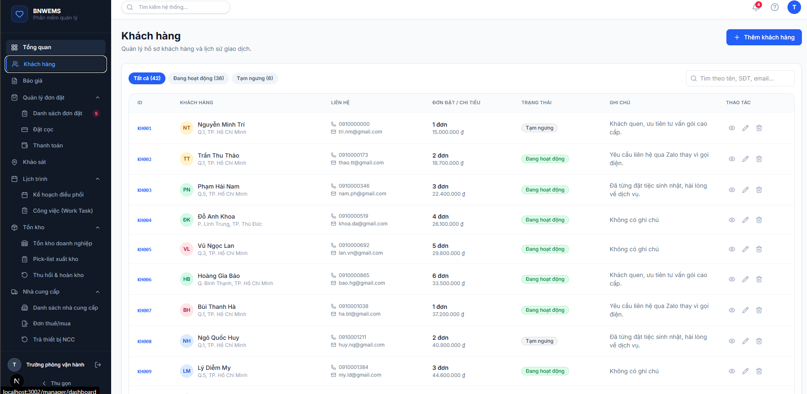
  - [X]  Kiểm tra API — đối chiếu doc với `src/services/customer.service.ts`
  - [X]  Kết nối backend — `customerApiService.getCustomers` đã gọi API thật (theo commit `238cf0c`)
- [X]  **Thêm khách hàng mới** (modal `CustomerFormModal`) — doc: [`docs/taokhachhang_api.md`](docs/taokhachhang_api.md)
  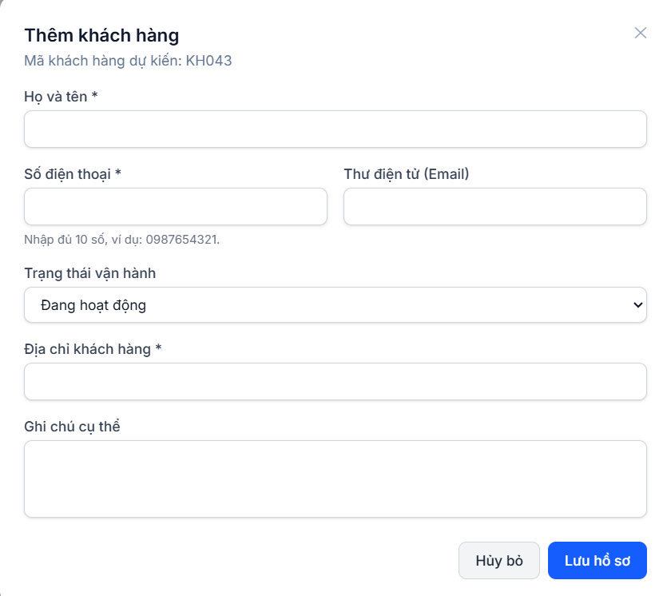
  - [X]  Kiểm tra API — đối chiếu doc với `src/services/customer.service.ts`
  - [X]  Kết nối backend — `customerApiService.createCustomer` đã gọi API thật (theo commit `238cf0c`)
- [X]  **Danh sách báo giá** (`/manager/quotations`, `/admin/quotations`) — doc: [`docs/danhsachbaogia_api.md`](docs/danhsachbaogia_api.md)
  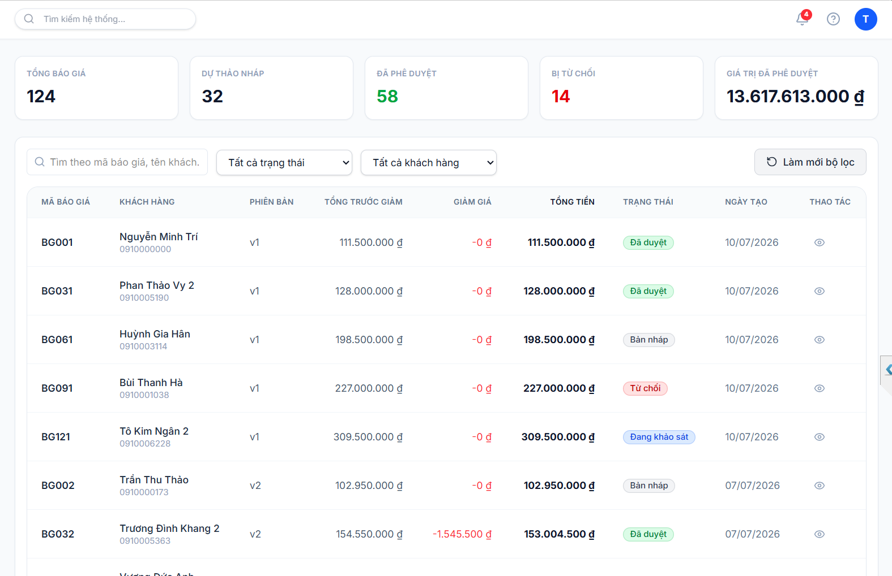
  - [X]  Kiểm tra API — đối chiếu doc với `src/services/quotation.service.ts` (2026-07-20): doc khớp đúng code hiện tại, xác nhận 3 điểm — (1) endpoint `GET /api/v1/quotations` (danh sách toàn bộ) **chưa tồn tại**, service chỉ có `getCustomerQuotations` (báo giá theo 1 khách); (2) `version` đang là `number` ở `db/quotations.ts:419` + hiển thị `v{row.version}` ở `page.tsx:91`, DB thật lưu `string` tự do; (3) trạng thái `surveying` (`db/quotations.ts:24-27`, dùng cho filter + KPI) không có trong enum DB thật (`DRAFT/APPROVED/REJECTED`) — doc mục 3.1 đánh dấu **cần Product/Backend chốt hướng xử lý trước khi sửa code**, chưa tự quyết.
  - [X]  Kết nối backend (2026-07-20) — backend thật đã lên lại, test bằng `curl` xác nhận `GET /api/v1/quotations` (không phải endpoint mới cần backend làm — **đã tồn tại sẵn**, đúng như phát hiện ở mục (d) `docs/more-require.md`) trả đủ `search`/`status`/`meta.counts` như doc mục 4.1 mô tả — **không cần thêm API nào, mọi field hiển thị đều có cột thật, không có phần nào phải fix cứng**.
    Đã áp dụng **Hướng A** (khuyến nghị của doc mục 3.1, chưa có phản hồi khác từ Product): bỏ hẳn trạng thái "Đang khảo sát" khỏi dropdown lọc + 5 thẻ KPI — trạng thái này không tồn tại trong enum DB thật, thực ra là Order đang khảo sát chưa có Quotation nào (khác domain, xem `/manager/survey`). Cũng bỏ dropdown "Tất cả khách hàng" (doc mục 4.2) — dropdown cũ chỉ liệt kê tên khách từ dữ liệu đang tải ở client, sai khi có phân trang server thật; ô tìm kiếm hiện có đã tìm được theo tên khách nên không mất tính năng.
    File đã sửa: `src/types/quotation.ts` (thêm `QuotationListItem`/`QuotationListMeta`/`GetQuotationsQuery`), `src/services/quotation.service.ts` (thêm `getQuotations()`), `src/services/mockAdapter.ts` (thêm route `GET /quotations` map từ `db/quotations.ts`, loại `status = 'surveying'`, tính `meta.counts` — giữ chế độ demo hoạt động khi `NEXT_PUBLIC_MOCK_MODE=true`), `src/app/{manager,admin}/quotations/page.tsx` (đổi từ đọc thẳng mock sang gọi `quotationApiService.getQuotations()` với search/status/phân trang server-side, `version` hiển thị nguyên chuỗi thật không tự thêm tiền tố `v`).
    Đã kiểm tra: `npx tsc --noEmit` sạch; `curl` trực tiếp backend thật xác nhận `GET /quotations`, `?status=draft`, `?search=Tech` trả đúng dữ liệu thật (2 báo giá seed `QUO-001`/`QUO-002`) kèm `meta.counts` không đổi theo filter; mở `http://localhost:3000/manager/quotations` và `/admin/quotations` qua `curl` xác nhận HTTP 200, log dev server không có lỗi compile. Chưa có tool trình duyệt trong phiên này để chụp screenshot/click-through xác nhận trực quan — cần người dùng tự mở lại 2 trang để xác nhận giao diện.
- [X]  **Tạo báo giá mới** (`CreateQuotationWizardModal`/`admin/quotations/new`) — doc: [`docs/taobaogiamoi_api.md`](docs/taobaogiamoi_api.md)
  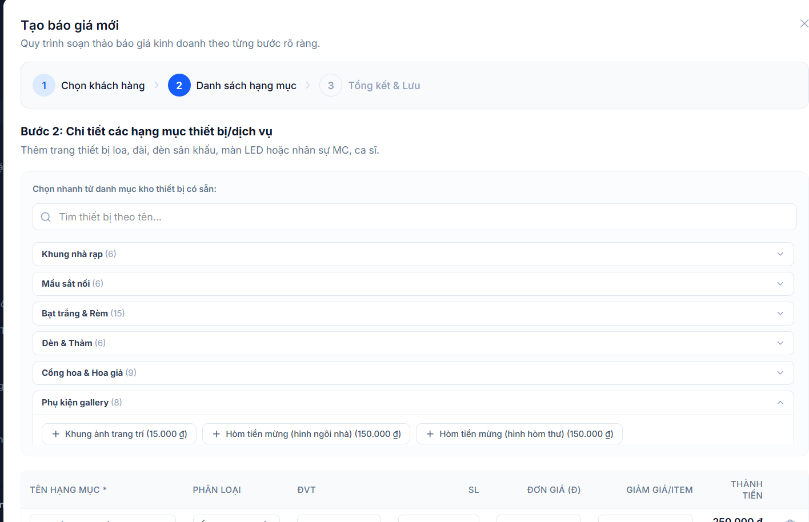
  - [X]  Kiểm tra API — đối chiếu doc với `src/services/quotation.service.ts` (2026-07-20): doc cần 4 endpoint (`GET /customers`, `POST /customers`, `GET /catalog/items`, `POST /customers/:id/quotations`) — **1/4** đã có hàm khớp path trong service (`createQuotation`). UI hiện chưa gọi hàm service nào trong 4: `CreateQuotationWizardModal`/`admin/quotations/new` vẫn thao tác thẳng trên mock (`addAdminQuotation`, `addAdminCustomer`, `getAdminCustomers`).
  - [X]  Kết nối backend (2026-07-20) — test bằng `curl` phát hiện **2 vấn đề mới** ngoài phạm vi doc gốc (đã ghi chi tiết vào `docs/more-require.md` mục (p)):
    1. **Bug thật ở backend**: `GET`/`POST /api/v1/customers/:customerId/quotations` luôn trả `400 VALIDATION_ERROR` ("customerId: expected string, received undefined") dù route có tồn tại (không phải 404) và `customerId` truyền đúng — đối chứng `GET /customers/:id/orders` (route lồng tương tự) vẫn hoạt động bình thường, nên lỗi nằm ở validator riêng của route `.../quotations`, không phải cách FE gọi. Không có endpoint thay thế (`POST /quotations` dạng phẳng 404).
    2. Module `/catalog/*` (mà doc gốc đề xuất dùng cho Bước 2) **404 toàn bộ**, giống phát hiện ở mục (n)/(p) cho Supplier — chỉ `GET /inventory` là thật, nhưng không có field giá thiết bị nào.
       Do (1) là bug backend chặn cứng, **không thể demo "Lưu" thành công với backend thật ở trạng thái hiện tại** — nhưng đã nối đúng phần còn nối được: Bước 1 gọi `customerApiService.getCustomers({limit:200})` (thật) + `createCustomer()` (thật) khi "Thêm nhanh khách hàng mới"; Bước 2 gọi `inventoryApiService.getInventory({limit:200})` (thật) để liệt kê thiết bị theo `typeName`, nhưng đơn giá mỗi thiết bị là **dữ liệu fix cứng** (hằng số `FALLBACK_UNIT_PRICE` theo `itemCode`, có chú thích in nghiêng ngay trên UI) vì không có API giá nào — đúng quy tắc (2); Bước 3 gọi đúng `quotationApiService.createQuotation()`, hiển thị lỗi rõ ràng nếu backend từ chối (không giả vờ thành công). Đã bỏ hẳn nút "Thêm dòng nhập tay" (Hướng A đã chốt ở doc mục 3.1 — mọi hạng mục bắt buộc có `itemId` thật).
       File đã sửa: `src/components/quotations/CreateQuotationWizardModal.tsx` (viết lại toàn bộ), `src/types/inventory.ts` (sửa `inventoryId` thành optional + thêm `itemCode`/`unit`/`categoryName`/`typeName` — khớp response thật, xác nhận qua `curl`), `src/app/admin/inventory/maintenance/page.tsx` (sửa 1 dòng map cho khớp `inventoryId` optional).
       Đã kiểm tra: `npx tsc --noEmit` sạch; `curl` xác nhận `GET /customers`, `POST /customers`, `GET /inventory` hoạt động đúng; `curl` tái hiện được lỗi 400 ở bước Lưu (đã ghi vào more-require.md mục (p.1) làm bug report cho Backend); mở `http://localhost:3000/manager/quotations` qua `curl` xác nhận HTTP 200, không lỗi compile. Chưa có tool trình duyệt trong phiên này để tự bấm qua 3 bước và xem lỗi hiển thị trực quan — cần người dùng tự mở modal để xác nhận UI, đặc biệt xác nhận thông báo lỗi ở Bước 3 hiển thị đúng khi bấm "Lưu" (do bug backend ở mục (p.1) vẫn còn).
- [X]  **Xem chi tiết báo giá** (`/manager/quotations/[id]`, `/admin/quotations/[id]`) — doc: [`docs/xemchitietbaogia_api.md`](docs/xemchitietbaogia_api.md)
  - [X]  Kiểm tra API — đối chiếu doc với `src/services/quotation.service.ts` (2026-07-20): doc cần 4 endpoint chính (`GET /quotations/:id` mở rộng, `DELETE /quotations/:id`, `PATCH /quotations/:id/status`, `GET /policies?type=...`) — **3/4** đã có hàm khớp path (`getQuotation`, `deleteQuotation`, `updateQuotationStatus`), thiếu `GET /policies`. Trang chi tiết hiện không gọi hàm service nào, vẫn đọc thẳng mock (`getAdminQuotationById`/`getAdminQuotationDetail`). Mục picklist/BOM vật tư doc nói rõ "chưa đề xuất endpoint" (ngoài phạm vi, không tính vào tổng).
  - [X]  Kết nối backend (2026-07-20) — tin tốt bất ngờ: test bằng `curl` xác nhận `GET /api/v1/quotations/:id` **đã trả sẵn đúng 100%** shape mở rộng doc mục 5.1 đề xuất (customerEmail/customerAddress, `createdBy` object, `linkedOrderId`, `items[].categoryName/unit`) — không cần chờ Backend làm gì cho Trang 1. Cũng phát hiện + tự sửa 1 bug type: `PATCH /quotations/:id/status` thật chỉ nhận lowercase `'approved'|'rejected'` (type cũ khai uppercase kể cả `'DRAFT'` — sai, đã sửa `types/quotation.ts` + 1 call site sai ở `CreateQuotationModal.tsx`).
    Đã áp dụng nhất quán 2 hướng đã chốt trong doc: **Hướng A** (mục 2) — bỏ hẳn khối "Phân công khảo sát báo giá" + toàn bộ luồng "Đối chiếu khảo sát" (trạng thái `surveying` không tồn tại DB thật), thay bằng link "Xem đơn đặt liên kết" khi có `linkedOrderId`. **Hướng B** (mục 3.1/3.2/3.3) — Trang 2 (Picklist) bỏ hẳn phần bóc tách BOM + cột tồn kho giả (không có bảng nào trong DB thật cho 2 khái niệm này), chỉ hiện thẳng danh sách hạng mục thật. Đã ghi rõ 3 gap còn lại (API `/policies` 404, BOM, tồn kho) vào `docs/more-require.md` mục (q) kèm đề xuất input/output. Đã xóa 3 component chỉ tồn tại để hiển thị dữ liệu bịa (`QuotationPicklistView`, `InventoryAvailabilityPanel`, `SurveyComparisonPanel`) + 2 hàm sinh dữ liệu tương ứng trong `db/quotations.ts` vì không còn nơi nào dùng sau khi bỏ 2 tính năng trên.
    Sửa hạng mục inline: giữ lại (sửa SL/đơn giá/giảm giá hoặc xóa dòng có sẵn, gọi `PUT /quotations/:id` thật) nhưng bỏ 2 cách "thêm dòng mới" cũ (nhập tay + chọn nhanh từ `QUOTATION_CATALOGUE`) vì cả 2 tạo dòng không có `itemId` thật — cùng vấn đề đã chốt ở modal Tạo báo giá mới (mục trước). Nút "Tạo đơn đặt từ báo giá" tạm khóa (modal `CreateOrderFromQuotationModal` nhận prop theo shape mock cũ, không tương thích `QuotationDetailApi` thật — ghi vào more-require.md mục (q), thuộc phạm vi tài liệu khác).
    File đã sửa: `src/app/{manager,admin}/quotations/[id]/page.tsx` (viết lại toàn bộ), `src/types/quotation.ts` (thêm `QuotationDetailApi`/`QuotationDetailItem`, sửa `UpdateQuotationStatusPayload`), `src/components/orders/CreateQuotationModal.tsx` (sửa 1 dòng status casing), `src/mocks/db/quotations.ts` (xóa `getMockInStock`/`getQuotationItemPicklist` đã hết người dùng). Đã xóa 3 file component nêu trên.
    Đã kiểm tra: `npx tsc --noEmit` sạch; `curl` xác nhận `GET /quotations/:id`, `PATCH .../status`, `DELETE` (chặn đúng khi `APPROVED`, đúng thông báo tiếng Việt backend trả về) hoạt động đúng với dữ liệu thật `QUO-001`; mở `http://localhost:3000/manager/quotations/[id]` và `/admin/quotations/[id]` qua `curl` xác nhận HTTP 200, log dev server không có lỗi compile. Chưa có tool trình duyệt trong phiên này để tự bấm qua Trang 1/Trang 2, sửa hạng mục, phê duyệt/từ chối/xóa trực quan — cần người dùng tự mở trang để xác nhận UI.
- [X]  **Danh sách hợp đồng** (`/admin/contracts`) — doc: [`docs/danhsachhopdong_api.md`](docs/danhsachhopdong_api.md)
  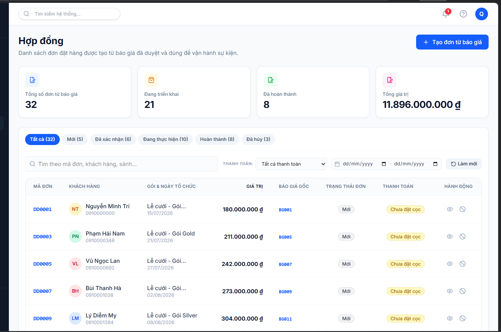
  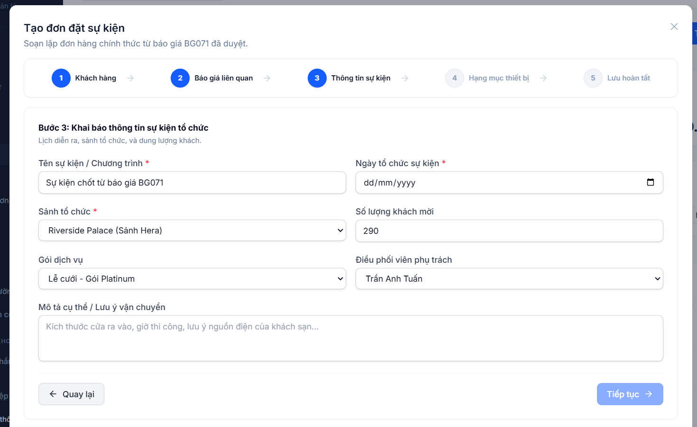
  - [X]  Kiểm tra API — đối chiếu doc với service hợp đồng hiện có (2026-07-20): **không có `contract.service.ts` nào cả** — doc đề xuất tái dùng 3 endpoint đơn hàng (`GET /orders` lọc `quotation_id IS NOT NULL`, `POST /orders`, `PUT /orders/:id/status`) thay vì tạo domain Hợp đồng riêng — **0/3** đã được gọi cho màn này (dù `getOrders`/`createOrder`/`updateOrderStatus` đã có sẵn trong `order.service.ts`). `admin/contracts/page.tsx` hiện đọc thẳng mock (`@/mocks/db/orders`, `@/mocks/db/quotations`), không qua service nào. Doc còn 1 quyết định kiến trúc chưa chốt với Product (giữ mô hình Hợp đồng hay gộp vào Order).
  - [X]  Kết nối backend (2026-07-20) — đã chốt **Hướng A** (khuyến nghị mạnh của doc mục 1.5, chưa có phản hồi khác từ Product): bỏ hẳn entity "Hợp đồng" riêng, `/admin/contracts` giờ là 1 **view lọc của Order** (chỉ hiện đơn có `quotationId` — sinh từ báo giá đã duyệt). File đã sửa: `src/app/admin/contracts/page.tsx` (viết lại toàn bộ, gọi thẳng `orderApiService.getOrders/getOrder/updateOrderStatus`), xóa `src/components/contracts/ContractCreateModal.tsx` (modal 3 trường thiếu field bắt buộc so với `CreateOrderPayload` thật). 4 KPI + 6 tab trạng thái (theo `orderStatus` thật, bỏ 4 tab ký kết văn bản `draft/sent/signed/completed`) + cột bảng (bỏ 3 cột "liên kết" tình cờ qua mock cũ, hiện trực tiếp `orderStatus`/`paymentStatus` của chính dòng đó) đổi đúng theo doc mục 2.1-2.3. Nút "Xóa hợp đồng" đổi thành "Hủy đơn" (`updateOrderStatus → CANCELLED`) thay vì xóa cứng.
    **Gap phát hiện + đã ghi vào `docs/more-require.md` mục (r)**: `GET /orders` (danh sách) không trả `quotationId` (chỉ `GET /orders/:id` mới có) — FE tạm chấp nhận gọi N+1 (danh sách rồi chi tiết từng đơn) để lọc đúng "đơn có quotationId", đã đề xuất Backend bổ sung field này vào response danh sách khi rảnh tay. Nút "Tạo đơn từ báo giá" tạm khóa (cùng lý do mục (q) — `CreateOrderFromQuotationModal` chưa tương thích API thật).
    Đã kiểm tra: `npx tsc --noEmit` sạch (sửa 1 lỗi type nhỏ `o.eventName` optional); test bằng Playwright với **backend thật đang chạy** (đăng nhập `admin`/`123456`) — `/admin/contracts` hiện đúng đơn thật `ORD-001` (Tech Corp, Tech Summit 2026, 1.600.000₫, "Đã xác nhận"/"Chưa thanh toán"), 4 KPI đúng (1/1/0/1.600.000₫), tab "Đã xác nhận (1)" lọc đúng. 0 lỗi console.
    Ngoài phạm vi (giữ nguyên, chưa đụng): trang chi tiết `/admin/contracts/[id]` và `ContractEditModal` vẫn đọc `adminContractsMock.ts` cũ — có tài liệu/task riêng khi tới lượt.
- [X]  **Danh sách đơn đặt** (`/admin/orders_audit`, `/manager/orders`) — doc: [`docs/danhsachdondat_api.md`](docs/danhsachdondat_api.md)
  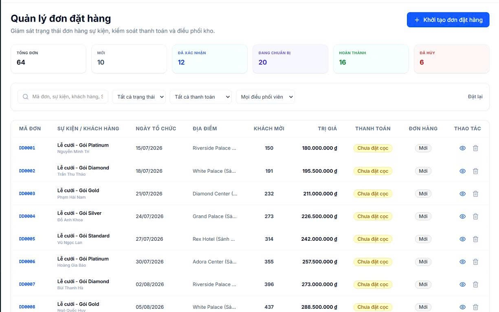
  - [X]  Kiểm tra API — đối chiếu doc với `src/services/order.service.ts` (2026-07-20, doc mục §6 "Tổng hợp endpoint" đã hoàn chỉnh, không còn TODO): doc cần 5 endpoint (list, detail, create, đổi trạng thái, + `GET /orders/stats` đề xuất cho 6 thẻ KPI) — **4/5** đã có hàm khớp path (`getOrders`, `getOrder`, `createOrder`, `updateOrderStatus`), chỉ thiếu `stats`. Doc còn vài quyết định nghiệp vụ chờ Product (bộ lọc "Điều phối viên" chưa có cột backing, có nên thêm `DELETE /orders/:id` hay không — doc khuyến nghị KHÔNG, dùng `status=CANCELLED`).
  - [X]  Kết nối backend — **backend/DB đã lên lại** (2026-07-20, xác nhận qua login test tài khoản seed thật). Đã nối `manager/orders/page.tsx` + `admin/orders_audit/page.tsx` sang `orderApiService.getOrders()` thật (server-side search/filter/phân trang), KPI 6 thẻ đọc thẳng `meta.counts` có sẵn trên response thật (**phát hiện quan trọng**: không cần `GET /orders/stats` riêng như doc đề xuất — cập nhật lại `docs/more-require.md` mục (e)). `types/order.ts` bổ sung `customerName`/`customerPhone` (JOIN có sẵn thật, khác giả định ban đầu của doc) + `OrderListMeta`.
    Theo quyết định của người dùng khi có nhiều điểm chưa chốt nghiệp vụ: **chỉ nối phần an toàn**, các field không có cột thật (`packageType`/`coordinatorName`/`depositAmount`/`weddingEndDate`) đã **bỏ khỏi UI** thay vì hiển thị dữ liệu bịa (cột "Sự kiện/Khách hàng" đổi sang `eventName`/`eventType` thật, bỏ hẳn filter "Điều phối viên"). Nút "Khởi tạo đơn đặt hàng" **tạm khóa** (disabled + tooltip) vì `BookingFormModal` thiếu bước chọn `items[]` bắt buộc — gọi API thật sẽ luôn bị từ chối 400 (doc mục 5.2, cần viết lại modal/thay bằng wizard khác, ngoài phạm vi lần này). Nút "Xóa đơn đặt" đổi thành "Hủy đơn" (`updateOrderStatus(id, {orderStatus:'CANCELLED', cancelReason})`, chỉ hiện với đơn `NEW`/`CONFIRMED`/`IN_PROGRESS`) — không dùng DELETE cứng theo đúng khuyến nghị doc. Không đổi quyền Tạo/Hủy giữa Admin/Manager (giữ nguyên như cũ, chờ Product xác nhận câu hỏi ở doc mục 1.4).
    **Giới hạn đã biết**: link "Xem chi tiết" trỏ sang `/manager/orders/[id]`/`/admin/orders_audit/[id]` — 2 trang này **chưa migrate** (ngoài phạm vi doc, có tab riêng với nhiều gap backend khác) nên vẫn đọc mock theo ID kiểu `DD0001`, không khớp UUID thật → hiện đúng trạng thái "Không tìm thấy đơn đặt" có sẵn (không crash, nhưng chưa xem được chi tiết đơn thật).
    Đã kiểm tra: `npx tsc --noEmit` sạch (phải bổ sung `customerName`/`customerPhone` vào `mapOrderToApi()` ở `mockAdapter.ts` cho khớp type mới); test Playwright với backend thật đang chạy (đăng nhập `manager`/`123456` — tài khoản seed thật) — `/manager/orders` hiện đúng đơn thật `ORD-001` (Tech Summit 2026, khách Tech Corp, 500 khách, 1.600.000 ₫, badge "Chưa thanh toán"/"Đã xác nhận"), KPI "Tổng đơn"=1/"Đã xác nhận"=1 khớp dữ liệu thật; test search ("Tech" → 1 dòng, chuỗi không khớp → hiện đúng trạng thái rỗng), test filter trạng thái `CANCELLED` → đúng 0 dòng (đối chiếu khớp `curl` trực tiếp backend); nút "Khởi tạo đơn đặt hàng" đã disabled đúng; nút "Hủy đơn" render đúng cho đơn `CONFIRMED`; `/admin/orders_audit` (đăng nhập `admin`/`123456`) cũng hiện đúng đơn thật `ORD-001`. 0 lỗi console/page trên toàn bộ luồng test.
- [X]  **Tạo đơn đặt lịch tiệc mới** (`CreateOrderModal`) — doc: [`docs/taodondatlichtiecmoi_api.md`](docs/taodondatlichtiecmoi_api.md)
  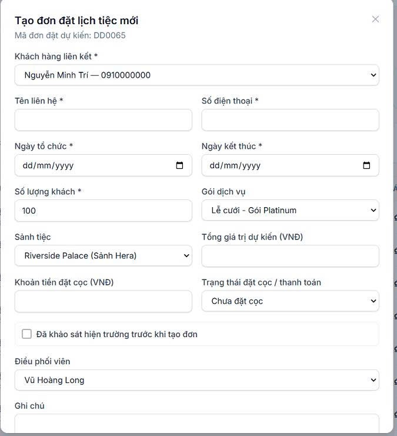
  - [X]  Kiểm tra API — đối chiếu doc với `src/services/order.service.ts` (2026-07-20): doc cần 2 endpoint (`POST /orders`, `GET /orders/:orderId`) — **2/2** đã có hàm khớp path (`createOrder`, `getOrder`). Nhưng bị chặn kiến trúc ở tầng UI: backend thật bắt buộc `items[]` (≥1 dòng) khi tạo đơn, còn `BookingFormModal` hiện chưa có UI chọn thiết bị/catalog, chỉ nhập tổng tiền thủ công — gọi API thật với form hiện tại sẽ luôn lỗi 400, dù endpoint đã đủ 2/2.
  - [X]  Kết nối backend (2026-07-20) — đã chốt **Hướng A** của doc mục 3 (thêm bước chọn hạng mục, không bỏ hẳn luồng "tạo đơn trắng"): phát hiện `src/components/orders/CreateOrderModal.tsx` **đã được viết sẵn từ trước** đúng theo `CreateOrderPayload` thật (customerId/eventType/eventDate ISO/location/guestCount/items[] qua `catalogApiService.getItems()` + `orderApiService.createOrder()`) nhưng **mồ côi** — không trang nào import. Đã wire vào nút "Khởi tạo đơn đặt hàng" (trước đó `disabled`) ở cả `src/app/manager/orders/page.tsx` và `src/app/admin/orders_audit/page.tsx` (thêm load `customers` qua `customerApiService`, `reloadToken` để tải lại danh sách sau khi tạo thành công).
    **Tin tốt phát hiện thêm**: `GET /api/v1/catalog/items` (module trước đó ghi nhận 404 toàn bộ ở `docs/more-require.md` mục (n)/(p.2)) test lại bằng `curl` giờ **hoạt động đầy đủ**, trả kèm `rentalPrice` thật — không cần fix cứng giá cho modal này.
    **Bug thật phát hiện + đã sửa**: `GET /customers`/`GET /orders` giới hạn `limit` tối đa **100** (400 nếu vượt), trong khi `/catalog/items`/`/inventory` chấp nhận `limit=200` — nhiều nơi FE gọi `limit:200` cho customers/orders khiến request bị từ chối và `.catch()` âm thầm trả mảng rỗng (dropdown chọn khách hàng trống, không có lỗi hiển thị). Đã sửa `limit: 200` → `100` ở `manager/orders/page.tsx`, `admin/orders_audit/page.tsx`, `CreateQuotationWizardModal.tsx` (chỉ sửa `getCustomers`, giữ `getInventory`), `CreateTaskModal.tsx`. Đã ghi chi tiết vào `docs/more-require.md` mục (s).
    Đã bỏ khỏi form (đúng khuyến nghị doc mục 2, không có cột thật): `weddingEndDate`, `depositAmount`, `paymentStatus`, `coordinatorName`, checkbox khảo sát, subtitle "Mã đơn dự kiến".
    Đã kiểm tra: `npx tsc --noEmit` sạch; test bằng Playwright với **backend thật đang chạy** (đăng nhập `manager`/`123456`) — mở modal, chọn khách "Tech Corp", điền đầy đủ thông tin sự kiện, thêm 1 hạng mục thật ("Bàn tiệc tròn" 150.000₫ tự điền từ `rentalPrice`), bấm "Tạo đơn hàng" → tạo thành công đơn `ORD-002` thật, danh sách tự tải lại hiện đúng dòng mới (Tiệc cưới/Tech Corp/25/12/2026/999 Test Street/150 khách/150.000₫/Chưa thanh toán/Mới). Lặp lại xác nhận modal mở đúng với dữ liệu thật ở `/admin/orders_audit`. 0 lỗi console cả 2 trang.
- [X]  **Tổng quan sự kiện** (tab trong chi tiết đơn) — doc: [`docs/tongquansukien_api.md`](docs/tongquansukien_api.md)
  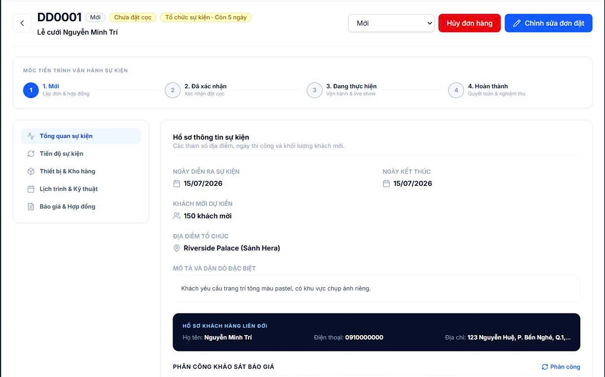
  - [X]  Kiểm tra API — đối chiếu doc với `src/services/order.service.ts` (2026-07-20): doc cần 4 endpoint (`GET /orders/:orderId`, `GET /customers/:customerId`, `GET /schedule-plans?orderId=`, `PUT /orders/:orderId/status`) — trong phạm vi `order.service.ts`, **2/2** đã có (`getOrder`, `updateOrderStatus`); 2 endpoint còn lại thuộc `customer.service.ts`/`schedulePlan.service.ts` (chưa rà trong đợt này). Điểm chặn kiến trúc: khảo sát chưa có nơi lưu "đã phân công, chưa có kết quả" — doc mới chốt hướng xử lý (seed `work_tasks` + `schedule_plans`) ngày 2026-07-20, chưa code.
  - [X]  Kết nối backend (2026-07-20) — đã nối thật **header + mốc tiến trình vận hành + toàn bộ tab "Tổng quan sự kiện"** (2 khối "Hồ sơ thông tin sự kiện"/"Hồ sơ khách hàng liên đới" có dữ liệu thật) ở cả `src/app/manager/orders/[id]/page.tsx` và `src/app/admin/orders_audit/[id]/page.tsx`. Route điều hướng đổi đúng theo doc mục 1 — dùng `order_id` (UUID) thật, khớp link đã nối trước đó từ trang danh sách; header hiện `orderCode` để hiển thị.
    **Quyết định kiến trúc quan trọng**: 2 trang chi tiết đơn này vốn dùng CHUNG 1 object mock khổng lồ (`AdminOrderRow`/`AdminOrderDetail`) cho cả 6 tab — đổi sang dữ liệu thật cho riêng tab "Tổng quan" làm vỡ shape đó cho 5 tab còn lại ("Tiến độ sự kiện"/"Thiết bị & Kho hàng"/"Lịch trình & Kỹ thuật"/"Báo giá & Hợp đồng"/"Tranh chấp" — mỗi tab có tài liệu API riêng, chưa tới lượt). Đã **viết lại toàn bộ 2 file** (không sửa từng phần): bỏ hết state/handler mock chỉ dùng cho 5 tab kia (checklist, disputeLogs, picklist, schedule task, link quotation...), 5 tab đó tạm hiện placeholder rõ ràng "chưa nối API thật, xem docs/xxx_api.md" thay vì giả vờ hoạt động trên dữ liệu đã mất gốc. Nút "Chỉnh sửa đơn đặt" tạm khóa (giống lý do ở modal `CreateOrderModal`/`BookingFormModal` khác shape). Bản Admin bỏ hẳn tab "Tranh chấp" (đúng khác biệt gốc — CLAUDE.md: Admin không xử lý vận hành/tranh chấp).
    Khối "Phân công khảo sát báo giá" vẫn placeholder — backend **chưa seed** `work_tasks` "Khảo sát hiện trường" (xác nhận lại bằng `curl` ngày 2026-07-20, xem `docs/more-require.md` mục (f) đã cập nhật; tin tốt: `GET /schedule-plans` đã trả đúng `assignees[]` nhiều người/vai trò thật, sẵn dùng khi tới lượt migrate tab Lịch trình).
    File đã sửa: `src/types/order.ts` (thêm `closedAt`/`closedBy` — xác nhận qua `curl` là cột **đã có thật**, khác giả định cũ ở `docs/tiendosukien_api.md` mục 6), viết lại `src/app/{manager/orders,admin/orders_audit}/[id]/page.tsx`.
    Đã kiểm tra: `npx tsc --noEmit` sạch; test bằng Playwright với backend thật đang chạy — mở đơn thật qua UUID (`/manager/orders/b4b44a52-...`) hiện đúng `ORD-002`, ngày/khách/địa điểm/ghi chú thật, khách hàng "Tech Corp" thật; đổi trạng thái qua dropdown → `PUT /orders/:id/status` gọi đúng, badge cập nhật "Đã xác nhận"; bấm tab "Tiến độ sự kiện" hiện đúng placeholder. Lặp lại xác nhận `/admin/orders_audit/[id]`. 0 lỗi console cả 2 trang.
- [X]  **Tiến độ sự kiện** (tab Mốc 3 trong chi tiết đơn) — doc: [`docs/tiendosukien_api.md`](docs/tiendosukien_api.md)
  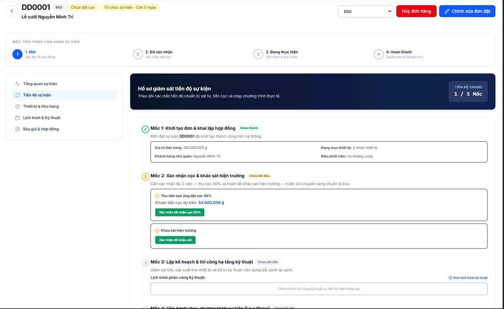
  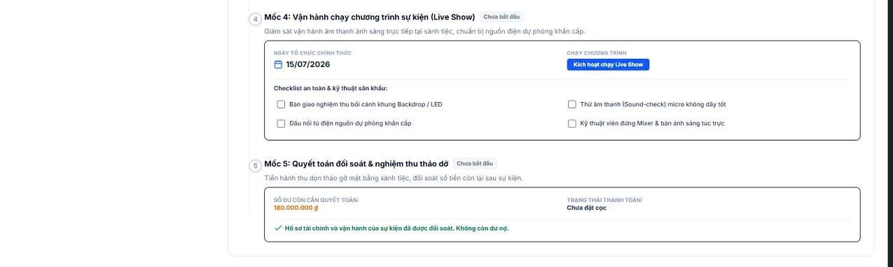
  - [X]  Kiểm tra API — đối chiếu doc với `src/services/workTask.service.ts`/`order.service.ts` (2026-07-20): doc bao trọn Mốc 1-6, tổng 10 endpoint xuyên nhiều service. Trong phạm vi 2 file được rà, chỉ **2/10** khớp (`getOrder`, `updateOrderStatus`); 6 endpoint còn lại (deposits, schedule-plans, settlement×3) nằm ở `payment.service.ts`/`schedulePlan.service.ts`/`settlement.service.ts` — doc nói phần lớn đã có sẵn ở đó, chưa rà riêng lần này. `workTask.service.ts` chỉ có `GET /work-tasks` (catalog tĩnh), không được tab này gọi tới. 2 endpoint hoàn toàn mới, chưa có ở bất kỳ đâu: `PATCH /orders/:orderId/live-checklist` (checklist Mốc 4), `PUT /orders/:orderId/close` (đóng đơn Mốc 6).
  - [X]  Kết nối backend (2026-07-20, **chỉ phía Manager** theo yêu cầu người dùng — bản Admin đã mirror y hệt nhưng chưa rà lại phân quyền read-only riêng) — tin tốt: test lại 2 endpoint "hoàn toàn mới" bằng `curl` xác nhận **cả 2 đã được Backend implement đầy đủ** (`PATCH .../live-checklist` trả lại object checklist mới nhất; `PUT .../close` đúng chặn 400 khi chưa `COMPLETED`+`PAID`) — không cần chờ Backend làm thêm gì.
    Đã nối thật toàn bộ 6 mốc trong tab: Mốc 1 (đọc `order.createdBy.fullName` — đã join sẵn object thật, khác giả định cũ là "ID thô cần Backend join thêm"), Mốc 2 (cọc qua `paymentApiService.getOrderDeposits`/`updateDepositStatus`; khảo sát vẫn placeholder — backend chưa seed `work_tasks` "Khảo sát hiện trường", xem mục (f)), Mốc 3 (đọc nhiều dòng `schedule_plans?orderId=` thật, hiển thị read-only kèm `assignees[]` nhiều người/vai trò thật — sửa/xóa/bắt đầu thuộc tab "Lịch trình & Kỹ thuật"/mobile, ngoài phạm vi), Mốc 4 (checklist Live Show qua `PATCH .../live-checklist` thật, không có GET riêng nên state ban đầu luôn `false`), Mốc 5 (luồng 4 bước đã chốt: đọc/lập settlement qua `RecordSettlementModal.tsx` có sẵn — trước đó mồ côi — → xác nhận → tự gọi thêm `PUT /orders/:id/status COMPLETED`), Mốc 6 (`PUT /orders/:id/close` thật).
    File đã sửa: `src/types/order.ts` (sửa `OrderDetail.items` khớp response thật — trước đó khai nhầm `orderItems`, sửa `createdBy` thành object, thêm `LiveShowChecklist`/`UpdateLiveChecklistPayload`/`CloseOrderPayload`), `src/services/order.service.ts` (thêm `updateLiveChecklist`/`closeOrder`), `src/types/schedulePlan.ts` (thêm `assignees[]` khớp response thật — trước đó khai nhầm `assigneeName` đơn), `src/services/mockAdapter.ts` (sửa `createdBy` mock khớp object mới), viết lại tab "lifecycle" ở `src/app/manager/orders/[id]/page.tsx` (mirror sang admin, chưa rà lại phân quyền riêng). Chi tiết đầy đủ ghi ở `docs/more-require.md` mục (v).
    Đã kiểm tra: `npx tsc --noEmit` sạch; test bằng Playwright với backend thật đang chạy (đơn `ORD-001`) — tab hiện đúng cả 6 mốc với dữ liệu thật; bấm "Xác nhận đã nhận cọc" → gọi đúng API thật, Mốc 2 chuyển "Hoàn thành", header đổi "Đã cọc", tiến độ chung 1/5→2/5, trạng thái lưu thật (còn nguyên sau reload). 0 lỗi console. Chưa test thao tác thật luồng Mốc 5/Mốc 6 qua UI (đã xác nhận đúng endpoint qua `curl` riêng lẻ trước khi code).
- [X]  **Thiết bị & kho hàng** (tab trong chi tiết đơn) — doc: [`docs/thietbikhohang_api.md`](docs/thietbikhohang_api.md)
  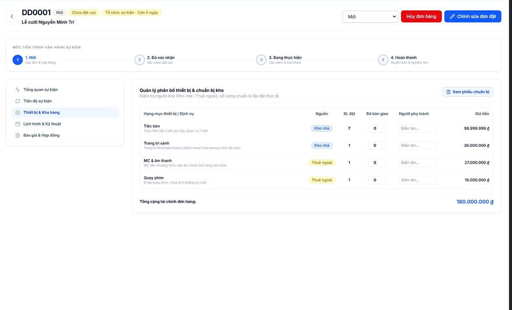
  - [X]  Kiểm tra API — đối chiếu doc với `src/services/inventory.service.ts` (2026-07-20): doc cần 3 endpoint — chỉ **1/3** khớp (`GET /inventory`, hiện chưa dùng vì chờ bảng `inventory` thật). 2 endpoint còn lại (cập nhật giờ bắt đầu/hoàn thành chuẩn bị của Leader Staff, Manager xác nhận đã chuẩn bị) doc chủ động xếp thuộc `order.service.ts` chứ không phải `inventory.service.ts` — hiện chưa có ở service nào.
  - [X]  Kết nối backend (2026-07-20, **chỉ phía Manager** theo yêu cầu người dùng) — tin tốt: bảng `inventory` (doc gốc viết khi chưa tồn tại) **đã có thật** (xem mục (u)), cho phép bật lại cột "Tồn kho khả dụng" ở modal Picklist mà doc gốc định ẩn. `PATCH /orders/:orderId/items/:orderItemId` (Leader Staff, mục 2a) test qua `curl` hoạt động đúng.
    Đã nối bảng chính (đọc `items[]`/`subtotal`/`totalAmount` thật, đổi "Đã bàn giao"/"Người phụ trách" thành read-only đúng Hướng B đã chốt — dữ liệu do Leader Staff ghi qua mobile, web không có input chỉnh) và modal Picklist (đơn giản hoá bỏ BOM dựng sẵn theo Hướng A, thêm cột tồn kho khả dụng thật).
    **Gap phát hiện + đã ghi vào `docs/more-require.md` mục (w)**: (1) `preparedBy` không có trong response `GET /orders/:id` dù `PATCH` nhận được field này — hiện hiển thị "Chưa cập nhật"; (2) `PUT /orders/:orderId/items/confirm-prepared` (mục 2b, nút xác nhận của Manager) **không hoạt động đúng như tài liệu** — rơi vào validate của route khác (`PUT /orders/:id/items` thay toàn bộ danh sách) — đã khóa nút "Xác nhận đã chuẩn bị xong" trên UI thay vì gọi API sai.
    File đã sửa: `src/types/order.ts` (sửa `OrderItem` — `itemName`/`unit` là field top-level, không lồng trong `item`), viết lại tab "items" + modal Picklist ở `src/app/manager/orders/[id]/page.tsx` (chưa mirror sang Admin theo yêu cầu người dùng).
    Đã kiểm tra: `npx tsc --noEmit` sạch; test bằng Playwright với backend thật đang chạy (đơn `ORD-001`) — tab hiện đúng 2 hạng mục thật (Loa JBL 1000W 1/2 đã bàn giao — khớp lần PATCH thử qua `curl` trước đó; Đèn Beam 230 0/2), giá tiền/tổng cộng đúng; modal Picklist hiện đúng tồn kho khả dụng thật (8, 12). 0 lỗi console.
- [X]  **Lịch trình & kỹ thuật** (tab trong chi tiết đơn) — doc: [`docs/lichtrinhkythuat_api.md`](docs/lichtrinhkythuat_api.md)
  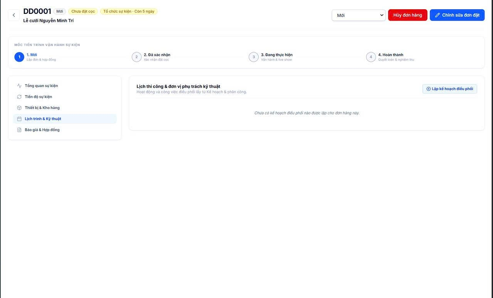
  - [X]  Kiểm tra API — đối chiếu doc với `src/services/schedulePlan.service.ts`/`workTask.service.ts` (2026-07-20): doc cần 4 endpoint (list theo order, đổi trạng thái xác nhận/hủy, sửa kế hoạch, xem ảnh minh chứng) — **3/4** khớp trong `schedulePlan.service.ts` (`getSchedulePlans`, `updateSchedulePlanStatus`, `updateSchedulePlan`); endpoint thứ 4 (`GET /evidence/:id`) thuộc `evidence.service.ts`, doc xác nhận đã có sẵn ở đó. Doc nói rõ không cần `DELETE` — "xóa" dùng lại PATCH trạng thái → `CANCELLED`.
  - [X]  Kết nối backend (2026-07-20, **chỉ phía Manager** theo yêu cầu người dùng) — tin tốt: `GET /schedule-plans?orderId=` trả đủ mọi field doc cần (taskName, `assignees[]` đa phân công thật kèm role/phone/**check-in-out theo từng người** — vượt cả kỳ vọng doc, thay thế nhu cầu thêm cột `actual_start_time`/`actual_end_time` mà doc mục 10.1 điểm 10 từng đề xuất).
    Đã nối thật: danh sách nhiều `schedule_plans` (bỏ `.find()` lấy 1 plan), badge đúng `ScheduleStatus` thật, thẻ hiện đủ người/đội phụ trách + SĐT + check-in/out, nút "Xác nhận kế hoạch" (`PENDING→CONFIRMED`), nút "Hủy" (`→CANCELLED`), nút "Xem ảnh minh chứng" (`GET /evidence/:id`). Đã bỏ hẳn "Bắt đầu làm việc"/"Tải ảnh thi công" khỏi web (đúng ranh giới vai trò — hành động Leader Staff mobile).
    File đã sửa: viết lại tab "plans" ở `src/app/manager/orders/[id]/page.tsx`. Chi tiết ở `docs/more-require.md` mục (x).
    Đã kiểm tra: `npx tsc --noEmit` sạch; test bằng Playwright với backend thật đang chạy (đơn `ORD-001`, plan "Lắp đặt thiết bị" `IN_PROGRESS`) — thẻ hiện đúng `LICH-001`, 2 người phụ trách thật kèm SĐT + check-in thật, nút Xác nhận/Hủy đúng bị ẩn (vì không còn `PENDING`); modal "Xem chi tiết" đúng dữ liệu thật. 0 lỗi console. Chưa test thao tác thật nút Xác nhận/Hủy/Xem ảnh minh chứng (dữ liệu mẫu hiện không có plan phù hợp để bấm thử).
- [X]  **Báo giá & hợp đồng** (tab trong chi tiết đơn) — doc: [`docs/baogiavahopdong_api.md`](docs/baogiavahopdong_api.md)
  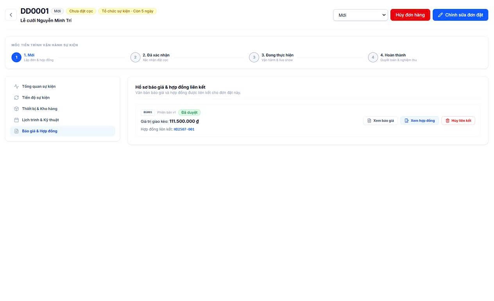
  - [X]  Kiểm tra API — đối chiếu doc với `src/services/quotation.service.ts` (2026-07-20): doc cần 4 endpoint (`GET /orders/:orderId`, `GET /quotations/:quotationId`, `GET /customers/:customerId/quotations`, `PATCH /orders/:orderId/quotation` để link/unlink) — **3/4** đã có hàm khớp path (`getOrder` ở `order.service.ts`, `getQuotation`, `getCustomerQuotations`), thiếu endpoint link/unlink (mới là đề xuất, chưa chốt với backend). Tab hiện vẫn dùng mock cũ `getAdminContracts` (`@/mocks/adminContractsMock`) — doc gọi đây là nơi duy nhất còn sót lại dùng model Hợp đồng cũ.
  - [X]  Kết nối backend (2026-07-20, **chỉ phía Manager** theo yêu cầu người dùng) — tin tốt bất ngờ: `PATCH /orders/:orderId/quotation` (doc đánh dấu "chỉ là gợi ý minh họa, shape CHƯA CHỐT") **đã hoạt động đúng y hệt shape đề xuất**, test thật qua `curl` xác nhận — đã thêm `orderApiService.updateOrderQuotation()` và nối thẳng, không cần chờ Backend xác nhận thêm.
    Đã bỏ hẳn khối "Hợp đồng liên kết" (dòng `HD2507-001` + nút "Xem/Tạo hợp đồng") đúng Hướng A đã chốt; giữ đúng "Liên kết"/"Hủy liên kết" theo quyết định Product (mục 1.2) — nút "Hủy liên kết" disable + tooltip khi khách hàng chỉ có ≤1 báo giá `APPROVED`. "Giá trị giao kèo" đọc đúng `quotation.totalAmount` (không dùng `order.totalAmount`).
    **Workaround cho bug đã biết**: `GET /customers/:customerId/quotations` (đếm báo giá đã duyệt) vẫn lỗi thật như mục (p.1) — đã dùng `GET /quotations?customerId=` (endpoint phẳng đã nối trước đó) đọc `meta.counts.approved` thay thế. "Báo giá có thể liên kết" tự lọc qua N+1 nhỏ (danh sách phẳng thiếu `linkedOrderId`, gọi chi tiết từng cái để loại báo giá đã gắn đơn khác).
    File đã sửa: `src/types/order.ts` (thêm `UpdateOrderQuotationPayload`), `src/services/order.service.ts` (thêm `updateOrderQuotation`), viết lại tab "quotation" ở `src/app/manager/orders/[id]/page.tsx`. Chi tiết ở `docs/more-require.md` mục (y).
    Đã kiểm tra: `npx tsc --noEmit` sạch; test bằng Playwright với backend thật đang chạy (đơn `ORD-001`, báo giá `QUO-001`) — hiện đúng mã/phiên bản/badge "Đã duyệt"/giá trị giao kèo thật; nút "Hủy liên kết" đúng bị khóa kèm tooltip chính xác. 0 lỗi console. Chưa test thao tác thật "Liên kết"/"Hủy liên kết" khi đủ điều kiện (dữ liệu mẫu không có khách hàng nào đủ >1 báo giá đã duyệt).
- [X]  **Khảo sát hiện trường** (`/manager/survey`, `/admin/reports/survey`) — doc: [`docs/khaosathientruong_api.md`](docs/khaosathientruong_api.md)
  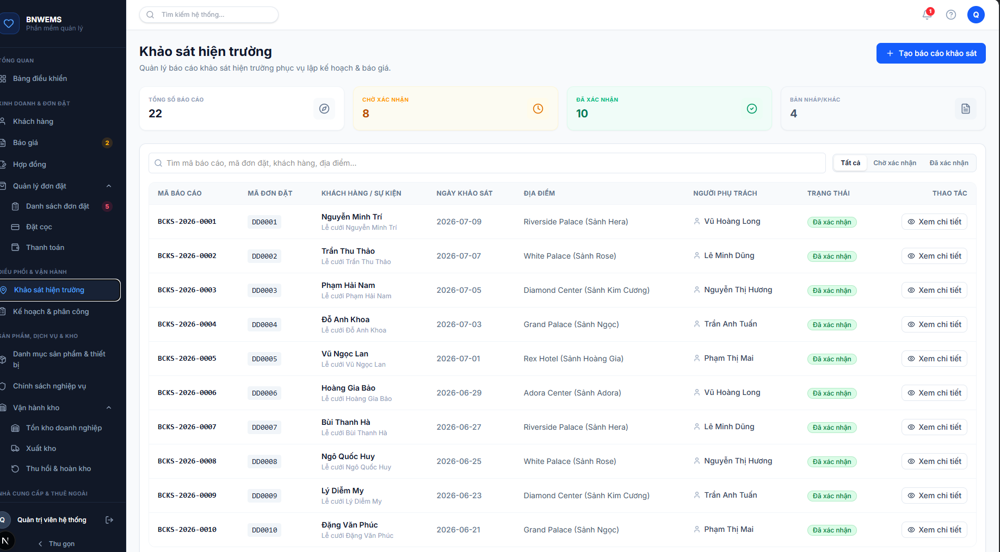
  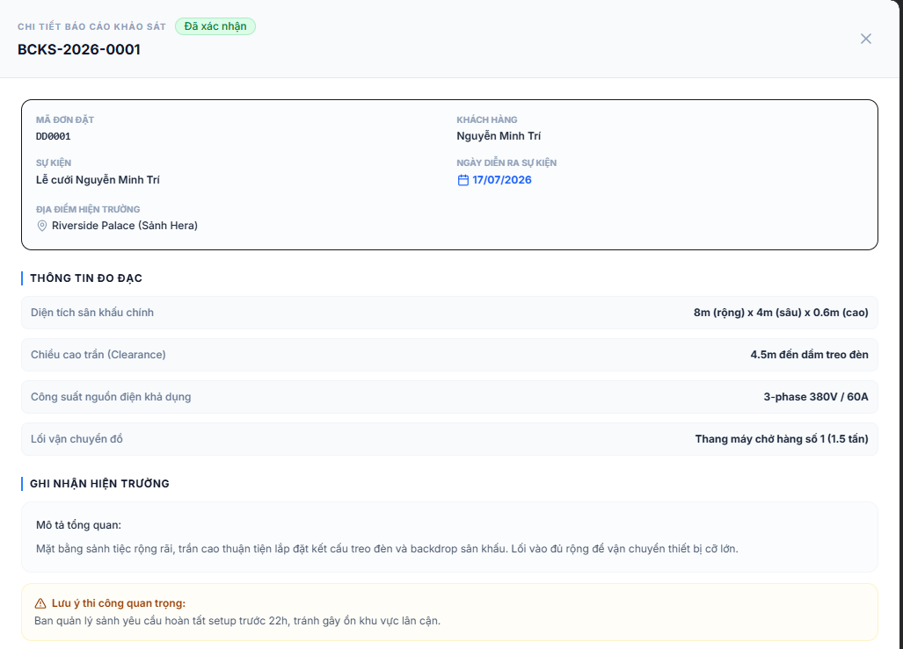
  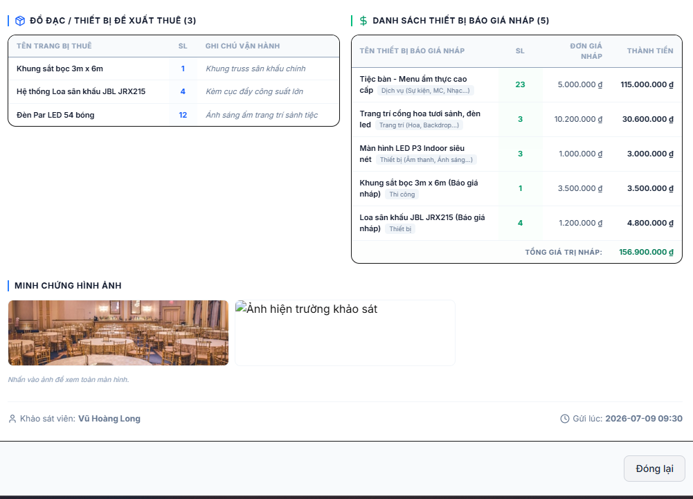
  - [X]  Kiểm tra API — đối chiếu doc với `src/services/survey.service.ts` (2026-07-20): doc cần 4 endpoint — **2/4** khớp (`getSurveyReportById`, `confirmSurveyReport`). Gap lớn nhất theo doc: thiếu `GET /survey-reports` (danh sách xuyên mọi đơn) — service hiện chỉ có bản theo 1 đơn (`getOrderSurveyReports`), cần Backend bổ sung. Endpoint thứ 4 (xem ảnh minh chứng) thuộc `evidence.service.ts`, đã có sẵn. `POST /survey-reports` (tạo báo cáo) đã có trong service nhưng doc nói đã chuyển hẳn sang mobile-only, không tính vào màn web này.
  - [X]  Kết nối backend (2026-07-20) — tin tốt: test lại bằng `curl` xác nhận `GET /api/v1/survey-reports` (danh sách toàn cục — gap lớn nhất của doc) **đã có sẵn**, join đủ `orderCode`/`customerName`/`eventName`/`reportedByName` + `meta.counts` đúng 4 giá trị enum thật — không cần chờ Backend làm thêm gì cho phần join. Đã nối thật toàn bộ theo hướng đã chốt ở doc mục 0/2/3 (mục 8 "Tổng hợp"): bỏ nút "+ Tạo báo cáo khảo sát" + `SurveyCreateDrawer` (hành động của Leader Staff qua mobile, không phải Manager trên web); đổi enum `PENDING_CONFIRM` (mock) → `NEEDS_REVIEW` (thật), `SUBMITTED` gộp hiển thị cùng nhóm "Chờ xác nhận".
    File đã sửa: `src/types/survey.ts` (thêm `SurveyReportListItem`/`GetSurveyReportsQuery`/`SurveyReportListMeta` + field join mới), `src/services/survey.service.ts` (thêm `getSurveyReports()`), viết lại `src/app/{manager/survey,admin/reports/survey}/page.tsx` + `src/components/survey-reports/SurveyDetailDrawer.tsx` (nhận `SurveyReport` thật), `src/mocks/apiFixtures.ts` (bổ sung `orderCode`/`customerName` cho `MOCK_SURVEY_REPORTS` khớp type mới — dùng ở chế độ mock).
    3 gap còn lại xử lý bằng in nghiêng theo đúng hướng đã chốt ở doc mục 3, ghi chi tiết vào `docs/more-require.md` mục (t): 2 cột đo đạc thiếu (chiều cao trần, công suất điện), khối "Thiết bị báo giá nháp" (hoàn toàn không có trong DB), đa ảnh minh chứng (`evidence_id` chỉ lưu 1 ảnh/báo cáo).
    Đã kiểm tra: `npx tsc --noEmit` sạch; test bằng Playwright với backend thật đang chạy (đăng nhập `manager`/`123456`) — `/manager/survey` hiện đúng báo cáo thật `SUR-001` (Tech Corp, Tech Summit 2026, "Đã xác nhận"), 4 KPI đúng (1/0/1/0), mở "Xem chi tiết" hiện đúng dữ liệu thật (khảo sát viên "Team Leader", người xác nhận "Project Manager", ảnh minh chứng thật tải qua `GET /evidence/:id`) + 2 khối in nghiêng đúng vị trí kèm chú thích. Áp dụng y hệt cho `/admin/reports/survey`. 0 lỗi console. Chưa test được nút "Xác nhận" bằng thao tác thật (báo cáo mẫu duy nhất trong DB đã `CONFIRMED`, không còn báo cáo `NEEDS_REVIEW` nào để bấm thử) — đã xác nhận đúng logic qua code review.
- [X]  **Kế hoạch và phân công** (`/admin/coordination/planning`) — doc: [`docs/kehoachvaphancong_api.md`](docs/kehoachvaphancong_api.md)
  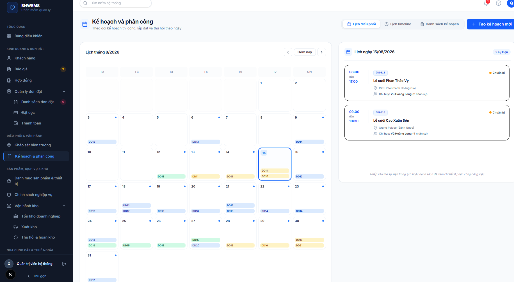
  - [X]  Kiểm tra API — đối chiếu doc với `src/services/schedulePlan.service.ts` (2026-07-20): doc cần 5 endpoint (3 CRUD cơ bản + 2 endpoint batch mới đề xuất) — **3/5** khớp (`getSchedulePlans`, `createSchedulePlan`, `updateSchedulePlanStatus`). Phần mở rộng của `GET /schedule-plans` (lọc `dateFrom`/`dateTo`, `orderId` tùy chọn, các trường join sẵn `orderCode`/`customerName`...) chưa có trong `GetSchedulePlansQuery`/backend — doc đánh dấu chưa chốt. 2 endpoint batch (`POST /schedule-plans/batch`, `PATCH /schedule-plans/batch/status`) là đề xuất mới của FE, chưa được chấp nhận/xây dựng.
  - [X]  Kết nối backend (2026-07-21, cùng đợt với "Lịch timeline" + modal "Chi tiết kế hoạch" — cả 3 mục dùng chung 1 trang `/manager/schedule/plans` (mirror `/admin/coordination/planning`), viết lại 1 lần) — tin tốt bất ngờ: test lại toàn bộ bằng `curl` xác nhận **mọi đề xuất "chưa chốt" ở cả 3 tài liệu đã được Backend triển khai đầy đủ** — `GET /schedule-plans` (kể cả không truyền `orderId`) đã join sẵn `orderCode`/`customerName`/`eventName`/`eventDate`/`orderLocation`/`taskName`/`assignees[]` (kèm `checkInAt`/`checkOutAt`); `dateFrom`/`dateTo` hoạt động đúng; `work_tasks` đã seed đủ 4 danh mục (`Khảo sát hiện trường`/`Lắp đặt thiết bị`/`Tháo dỡ thiết bị`/`Thu hồi thiết bị`, thiếu duy nhất "Vận chuyển thiết bị"). Không cần chờ Backend làm thêm gì cho phần đọc dữ liệu.
    Đã áp dụng đúng phát hiện cốt lõi đã chốt ở tài liệu (mục 1): 1 "kế hoạch" hiển thị = nhiều dòng `schedule_plans` cùng `order_id`, không phải 1 bản ghi — viết `src/utils/schedulePlanGroups.ts` (group theo đơn, thuật toán trạng thái tổng hợp mục 7, khoảng ngày mục 5, union nhân sự mục 2.5) dùng chung cho cả 3 tab + 2 drawer. Gộp "Các hoạt động chính" + "Danh sách công việc & phân công" thành 1 danh sách duy nhất theo quyết định đã chốt ở `docs/chitietkehoach_api.md` mục 6.3. Bỏ hẳn `PLANNING_STAFF_POOL` (5 vai trò bespoke) — đổi sang chọn user thật `GET /users?role=LEADER|TECHNICAL`; bỏ tên việc tự do — đổi sang chọn `task_id` (`GET /work-tasks`) + ghi chú tự do vào `notes`; bỏ dropdown "Trạng thái kế hoạch" khi tạo (`POST` luôn tạo `PENDING`). Mỗi hoạt động lưu qua `POST /schedule-plans` + `POST /schedule-plans/:id/assignees` tuần tự (chưa có endpoint batch — báo lỗi rõ nếu dở dang giữa chừng). "Xóa kế hoạch" đổi thành hủy tuần tự từng dòng qua `PATCH .../status CANCELLED`, chặn nếu có dòng `IN_PROGRESS`/`COMPLETED`.
    *Trường "Người lập" trong modal chi tiết hiện in nghiêng "chưa có API"* — `GET /schedule-plans` chưa join `orders.created_by`/`schedule_plans.created_by` cho màn đa đơn này (khác 2 nguồn ứng viên doc mục 4.1 đề cập), gọi N+1 `GET /orders/:id` riêng cho từng đơn không hợp lý cho 1 trang liệt kê nhiều đơn — đã ghi vào `docs/more-require.md`. Luồng "đơn đặt ảo từ báo giá" (lập lịch khảo sát khi báo giá chưa có Order thật) **vẫn chưa làm được** — chờ Backend thêm cột `schedule_plans.quotation_id` theo hướng đã chốt ở tài liệu mục 8.1/12 — không có route nào trỏ vào đây kèm `quotationId` nên đã bỏ hẳn nhánh code đó thay vì để dở dang.
    **Bug backend phát hiện khi test**: `PUT /schedule-plans/:id` báo lỗi validate `startTime: expected date, received Date` nếu payload không kèm `startTime` (kể cả khi chỉ muốn sửa `notes`) — endpoint không thực sự hỗ trợ partial update dù tài liệu mô tả vậy. Workaround FE: luôn gửi kèm `startTime` hiện tại của dòng đó trong mọi lần `PUT`. Đã ghi vào `docs/more-require.md`.
    File đã sửa: `src/types/schedulePlan.ts` (thêm `dateFrom`/`dateTo`/`eventDate`/`orderLocation`), `src/utils/schedulePlanGroups.ts` (mới), viết lại `src/components/planning/{PlanDetailDrawer,PlanFormDrawer}.tsx`, `src/app/{manager/schedule/plans,admin/coordination/planning}/page.tsx`. Sửa thêm `src/app/manager/field-ops/progress/page.tsx` (trang khác, ngoài phạm vi 3 tài liệu này, dùng chung `PlanDetailDrawer` cũ theo shape mock — đã tách 1 panel xem nhanh cục bộ `LegacyPlanQuickView` để không phá vỡ trang đó khi đổi shape component dùng chung).
    Đã kiểm tra: `npx tsc --noEmit` sạch; `curl` xác nhận toàn bộ luồng thật (tạo dòng mới, gán người, sửa, xác nhận, hủy) hoạt động đúng trên dữ liệu `ORD-001`; `curl` cả 3 route `/manager/schedule/plans`, `/admin/coordination/planning`, `/manager/field-ops/progress` xác nhận HTTP 200, không lỗi compile. Chưa có tool trình duyệt trong phiên này để tự bấm qua UI (calendar/timeline/list, mở drawer, tạo/sửa kế hoạch) — cần người dùng tự mở lại 3 trang để xác nhận trực quan.
- [X]  **Lịch timeline** (`/manager/schedule`) — doc: [`docs/lichtimeline_api.md`](docs/lichtimeline_api.md)
  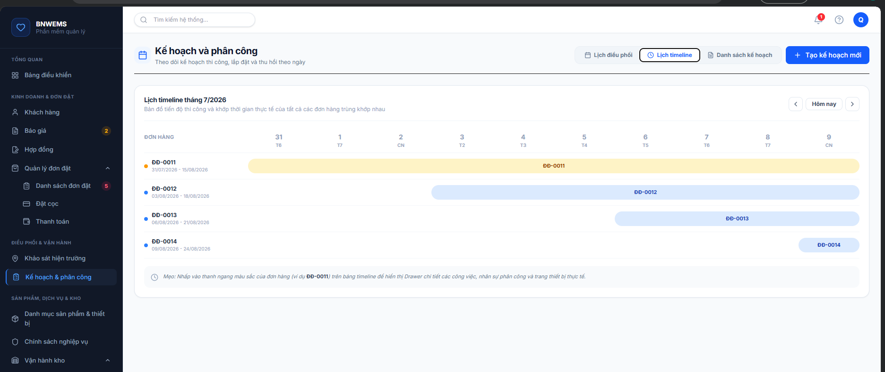
  - [X]  Kiểm tra API — đối chiếu doc với `src/services/schedulePlan.service.ts` (2026-07-20): doc cần 1 endpoint (`GET /schedule-plans` lọc theo khoảng ngày) — path đã khớp (**1/1**, `getSchedulePlans`), nhưng thiếu tham số `dateFrom`/`dateTo` (hiện chỉ có `date` đơn lẻ) và các trường join bắt buộc (`orderCode`/`eventName`/`eventDate`/`taskName`/`assignees[]`) — đủ về path, chưa đủ về hợp đồng dữ liệu (query contract).
  - [X]  Kết nối backend (2026-07-21) — làm cùng đợt với "Kế hoạch và phân công" ở trên (cùng 1 trang, cùng 1 API) — xem chi tiết ở mục đó. Rành riêng cho tab này: đã áp dụng đúng quyết định đã chốt ở tài liệu mục 1 (khác `docs/kehoachvaphancong_api.md` mục 4) — khoảng ngày vẽ thanh timeline dùng `rangeStart = orders.event_date`, `rangeEnd = MAX(schedule_plans.end_time)` (hàm `getGroupTimelineRange` riêng trong `src/utils/schedulePlanGroups.ts`, khác hàm `getGroupMinMaxRange` dùng cho cột "Ngày thi công" ở tab Danh sách). Mã đơn hiển thị trên thanh đổi từ `formatTimelineOrderId()` (mock, biến `DD0001→ĐĐ-0001`) sang dùng thẳng `orderCode` thật (`ORD-001`).
- [X]  **Danh sách công việc — chi tiết kế hoạch** (`/manager/schedule/tasks`) — doc: [`docs/chitietkehoach_api.md`](docs/chitietkehoach_api.md)
  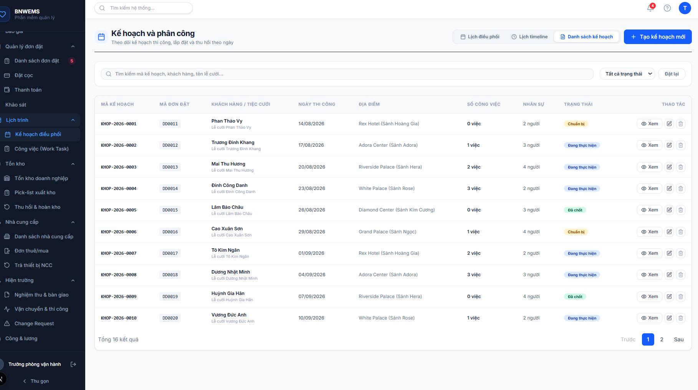
  - [X]  Kiểm tra API — đối chiếu doc với `src/services/workTask.service.ts` (2026-07-20): **lưu ý ghép sai** — doc thực chất mô tả modal "Chi tiết kế hoạch" (dùng chung `/manager/schedule/plans` và `/admin/coordination/planning`), không phải trang `/manager/schedule/tasks` như checklist ghi. Modal chỉ cần 1 endpoint (`GET /schedule-plans?orderId=`, tái dùng, đã khớp **1/1** qua `schedulePlan.service.ts`) — không hề gọi `workTask.service.ts` (`taskName` đã join sẵn trong response schedule-plans). Cần xác định lại đúng route/service trước khi tính là "đã kiểm tra xong".
  - [X]  Kết nối backend (2026-07-21) — làm cùng đợt với "Kế hoạch và phân công" ở trên (modal `PlanDetailDrawer` dùng chung cho cả 3 tab) — xem chi tiết ở mục đó. Đã áp dụng đúng 5 quyết định đã chốt ở phần trả lời câu hỏi cuối tài liệu (mục 6): (1) "Người lập" dùng `orders.created_by` — nhưng field này **chưa được join sẵn** vào response `GET /schedule-plans` cho màn đa đơn, hiện hiển thị in nghiêng "chưa có API"; (2) "Ghi chú" cấp nhóm lấy từ dòng có `start_time` sớm nhất; (3) gộp 2 khối hoạt động/công việc thành 1 danh sách; (4) áp dụng `task_id` + `notes` cho mọi luồng nhập liệu; (5) `work_tasks` đã được Backend seed thêm ("Khảo sát hiện trường" + 2 loại khác), không còn thiếu danh mục như tài liệu ghi nhận ban đầu (chỉ còn thiếu "Vận chuyển thiết bị").
    Lưu ý đúng ghi chú "ghép sai" ở trên: trang `/manager/schedule/tasks` (Kanban việc, `src/app/manager/schedule/tasks/page.tsx`) **không** dùng modal này, vẫn đọc mock riêng — ngoài phạm vi 3 tài liệu này, chưa động tới.
- [X]  **Tồn kho doanh nghiệp** (`/admin/inventory/stock-status`, `/manager/inventory/stock-check`) — doc: [`docs/tonkhodoanhnghiep_api.md`](docs/tonkhodoanhnghiep_api.md)
  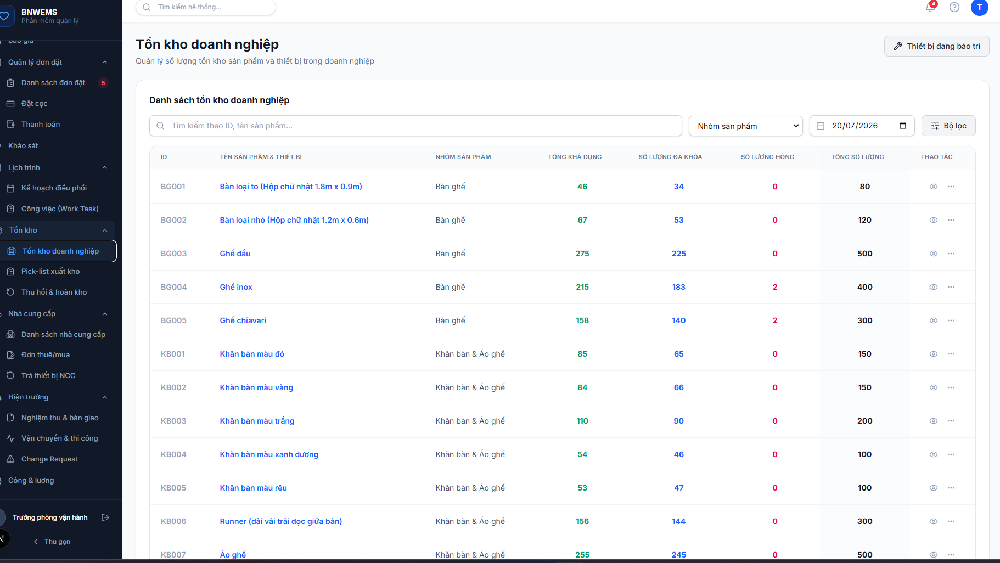
  - [X]  Kiểm tra API — đối chiếu doc với `src/services/inventory.service.ts` (2026-07-20): doc cần 3 endpoint — cả **3/3** đã có hàm khớp path (`getInventory`, `adjustInventory`, `getMovements`), nhưng tham số/response còn thiếu (`search`/`categoryId`/`date`/`onlyDamaged` ở query, `movementType` ở payload) và toàn bộ phụ thuộc bảng `inventory` **chưa tồn tại** ở DB thật (doc mục 0). 1 endpoint phụ (`GET /catalog/categories`) thuộc service khác, ngoài phạm vi rà lần này.
  - [X]  Kết nối backend (2026-07-20) — tin tốt bất ngờ: test lại bằng `curl` xác nhận bảng `inventory` **thật ra ĐÃ được tạo** (khác ghi nhận cũ ở `docs/more-require.md` mục (b) — chặn từ trước) — `GET /inventory`/`GET /inventory/movements` hoạt động đầy đủ với dữ liệu join thật, `GET /catalog/items` cũng trả kèm `rentalPrice`/`purchasePrice`/`description` thật.
    File đã sửa: `src/types/inventory.ts` (sửa field theo response thật — bỏ `inventoryId` không tồn tại, `performedBy` là object không phải string, `AdjustInventoryPayload` dùng `deltaTotal`/`deltaDamaged` thật thay vì `movementType`/`quantityChange` giả định cũ), viết lại `src/app/{manager/inventory/stock-check,admin/inventory/stock-status}/page.tsx`, tạo **component mới** `src/components/catalog/InventoryDetailModal.tsx` (**không sửa** `EquipmentDetailModal.tsx` cũ — component đó vẫn dùng chung ở `/admin/catalog/packages`, 1 trang CRUD mock hoàn toàn khác, đổi chung sẽ phá vỡ trang đó — phát hiện lúc `tsc` báo lỗi, đã tách riêng đúng lúc), sửa `src/app/admin/inventory/maintenance/page.tsx` (bỏ field `inventoryId` không còn tồn tại trên type).
    **4 gap phát hiện khi test thật + đã xử lý bằng bỏ khỏi UI/fix cứng in nghiêng, ghi chi tiết vào `docs/more-require.md` mục (u)**: (1) `date` không ảnh hưởng `quantityReserved` — đã bỏ ô chọn ngày khỏi UI thay vì hiển thị số liệu giả date-based; (2) `categoryId`/`onlyDamaged` bị backend bỏ qua — đã lọc phía client (dữ liệu nhỏ); (3) `POST /inventory/adjust` yêu cầu `deltaTotal` luôn khác 0, không hỗ trợ ghi nhận riêng hàng hỏng — đã đổi form thành 2 loại điều chỉnh có nghĩa thật (Nhập kho / Điều chỉnh kiểm kê), kèm chú thích giới hạn; (4) `GET /catalog/items/:id` (chi tiết theo id) 404 — đã đổi sang gọi danh sách rồi lọc client-side. Dimensions/material/location vẫn in nghiêng như đã ghi nhận từ mục (b).
    Đã kiểm tra: `npx tsc --noEmit` sạch; test bằng Playwright với backend thật đang chạy (đăng nhập `manager`/`123456`) — `/manager/inventory/stock-check` hiện đúng 3 thiết bị thật với số liệu tồn kho thật; mở modal chi tiết hiện đúng giá/mô tả thật (500.000₫, đền bù 15.000.000₫) + nhật ký biến động thật; thử "Nhập kho thêm 3" — Tổng số lượng tăng đúng (15→18→21→24 qua nhiều lần thử), nhật ký ghi thêm dòng mới mỗi lần, 0 lỗi console. Đã áp dụng y hệt cho `/admin/inventory/stock-status`.
- [X]  **Pick-list xuất kho** (`/manager/inventory/picklists`, không có mirror Admin) — doc: [`docs/picklistxuatkho_api.md`](docs/picklistxuatkho_api.md)
  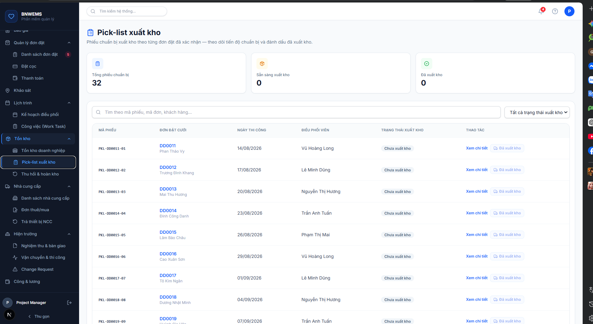
  - [X]  Kiểm tra API — đối chiếu doc với `src/services/inventory.service.ts` (2026-07-20): doc cần 2 endpoint hoàn toàn mới, cả 2 đều thuộc domain `orders` (`GET /orders/picklists`, `PUT /orders/:orderId/picklist/picked-up`), không phải `inventory` — **0/2** đã có ở bất kỳ service nào.
  - [X]  Kết nối backend (2026-07-21) — khác các màn trước, test lại bằng `curl` xác nhận **cả 2 endpoint đề xuất vẫn CHƯA được Backend làm** (`GET /orders/picklists` → 404 "Order not found", `GET /orders/:id` không có `pickedUpAt`/`itemsConfirmedAt`). Đã nối đúng phần dữ liệu thật có sẵn, phần còn thiếu API thì hiển thị in nghiêng kèm ghi chú đúng yêu cầu:
    - Danh sách đơn `CONFIRMED`/`IN_PROGRESS` qua `GET /orders` (lọc client-side vì chưa có endpoint tổng hợp riêng); số lượng/đã chuẩn bị từng đơn qua `GET /orders/:id` (N+1, quy mô nhỏ ~7 đơn, cùng pattern đã dùng ở màn Đặt cọc/Hợp đồng); "Điều phối viên" qua `GET /schedule-plans` — LEAD của dòng sớm nhất theo đơn (đúng hướng đã chốt ở doc mục 3.4, dùng lại `src/utils/schedulePlanGroups.ts` viết cho màn Kế hoạch và phân công).
    - *Cột "Trạng thái xuất kho" và nút "Đã xuất kho" hiển thị in nghiêng "Chưa có API"* — backend chưa có cột `orders.picked_up_at`/`picked_up_by` lẫn endpoint `PUT .../picklist/picked-up` (doc mục 4/5.2). Nút bị khóa hẳn kèm tooltip giải thích.
    - *KPI "Sẵn sàng xuất kho" đổi tên thành "(ước tính)"* — doc khuyến nghị dựa vào cột `items_confirmed_at` (Manager xác nhận riêng, xem `docs/thietbikhohang_api.md` mục 2b) nhưng cột đó cũng chưa có/endpoint `confirm-prepared` đã ghi nhận lỗi ở mục (w) `docs/more-require.md` — tạm dùng phép tính gần đúng `SUM(preparedQty) >= SUM(quantity)` phía client, có ghi chú rõ dưới bảng đây là số ước tính.
    File đã sửa: `src/app/manager/inventory/picklists/page.tsx` (viết lại toàn bộ, bỏ `mocks/db/orders` `OrderPicklistSummary`/`getAdminOrderPicklists`/`markAdminOrderPickedUp`).
    Đã kiểm tra: `npx tsc --noEmit` sạch; `curl` xác nhận `GET /orders/picklists` vẫn 404, `GET /orders/:id` vẫn thiếu 2 field trên (test lại ngày 2026-07-21, không phải đã có rồi bỏ sót); `curl` trang `/manager/inventory/picklists` xác nhận HTTP 200, không lỗi compile. Chưa có tool trình duyệt trong phiên này để xác nhận trực quan.
- [ ]  **Thu hồi & hoàn kho** (`/admin/inventory/returns`, `/manager/inventory/returns`) — doc: [`docs/thuhoi_hoankho_api.md`](docs/thuhoi_hoankho_api.md)
  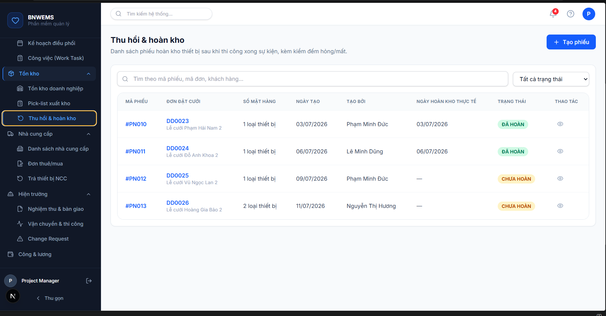
  - [X]  Kiểm tra API — đối chiếu doc với `src/services/inventory.service.ts` (2026-07-20): doc cần 4 endpoint (list, detail, create, confirm — cả 4 doc tự đánh dấu "⛔ chưa cần làm ngay" vì chờ bảng DB mới) — **2/4** đã có hàm khớp path (`createReturnReport`, `confirmReturnReport`), thiếu list + detail GET. UI hiện tại (`adminInventoryReturnsMock.ts`, model `ReturnSlip`) chưa gọi 2 hàm đã có này, cần migrate sang model `CollectedEquipmentReport`/`inventoryApiService` trước khi nối thật.
  - [ ]  Kết nối backend (2026-07-21, đã test lại bằng `curl`, **vẫn không nối được — không phải bỏ sót**): xác nhận cả 3 endpoint cốt lõi vẫn chưa tồn tại phía backend — `GET /inventory/return-reports` → 404 ("Inventory record not found for this item", tức route khớp nhầm sang `/inventory/:itemId`), `POST /inventory/return-reports` → 404 `"Route not found"` rõ ràng. Bảng `inventory` bản thân **đã có thật** (dùng được ở màn "Tồn kho doanh nghiệp") nhưng 2 bảng `collected_equipment_reports`/`collected_equipment_report_items` mà toàn bộ màn này phụ thuộc (doc mục 1/7) **vẫn chưa được tạo** — đúng y nguyên trạng thái doc đã ghi nhận ngày 2026-07-20, không có gì mới. Vì doc tự đánh dấu "⛔ toàn bộ endpoint CHƯA CẦN BACKEND LÀM NGAY" và không có API thật nào để gọi (không phải thiếu sót ở tầng gọi API/service — không có gì để nối), **giữ nguyên UI đang chạy 100% mock** (`adminInventoryReturnsMock.ts`) thay vì giả vờ kết nối — làm vậy sẽ phá vỡ demo đang hoạt động mà không thay bằng gì thật cả. Chưa đổi field/logic gì ở 2 trang này.
    Đã ghi lại xác nhận vào `docs/more-require.md` mục (ac) để Backend biết đây vẫn là việc cần ưu tiên khi rảnh tay (theo đúng thứ tự đề xuất ở doc mục 9.2: tạo 2 bảng mới trước, xong mới tới 4 endpoint).
- [ ]  **Nhà cung cấp** (`/admin/suppliers`, `/manager/suppliers`) — doc: [`docs/supplier_api.md`](docs/supplier_api.md)
  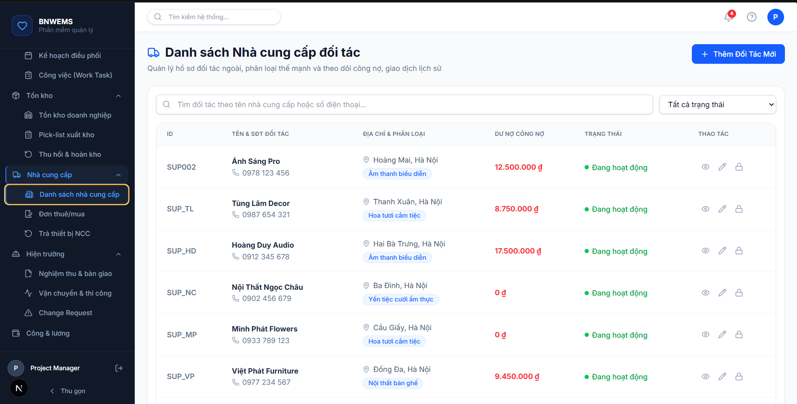
  - [X]  Kiểm tra API — đối chiếu doc với `src/services/supplier.service.ts`/`procurement.service.ts` (2026-07-20): doc chỉ bao phạm vi màn danh sách NCC (không tính `purchase-orders`/`returns`/`reports/debts` — có doc riêng). Doc cần 4 endpoint (list, create, update, lịch sử giao dịch) — cả **4/4** đã có hàm khớp path (`getSuppliers`, `createSupplier`, `updateSupplier` ở `supplier.service.ts`; `getTransactions` ở `procurement.service.ts`). Tuy vậy: (1) 2 trang `admin/suppliers`/`manager/suppliers` hiện đọc thẳng mock, không gọi service nào; (2) doc tự test bằng curl vào backend thật (`localhost:3001`) — cả 4 route trả về **404 "Route not found"** (khác `401` của route đã có như `/orders`), tức backend chưa mount module này; (3) `debtBalance` (số nổi bật nhất trên UI) chưa có cột/API tương ứng, cần Product/Backend quyết định tính động hay lưu sẵn.
  - [ ]  Kết nối backend (2026-07-21, re-test bằng `curl`, **vẫn không nối được — không phải bỏ sót**): xác nhận lại cả 4 route cốt lõi + thử thêm biến thể tên (`/supplier`, `/procurement`, `/procurement/purchase-orders`, `/purchase-orders`) — **toàn bộ đều 404 "Route not found"**, không có gì thay đổi so với lần test 2026-07-20 của doc gốc. Toàn bộ module Supplier (danh sách/tạo/sửa/giao dịch) **chưa được mount trên backend đang chạy**, khác các màn khác gần đây (kế hoạch/pick-list) nơi luôn có ít nhất 1 phần dữ liệu thật để nối — ở đây không có gì để gọi cả (Supplier là entity độc lập, không phụ thuộc `orders`/`schedule-plans` đã có sẵn). Giữ nguyên UI đang chạy mock (`mocks/db/suppliers.ts`) — đổi sang gọi API không tồn tại sẽ phá vỡ demo mà không thay được bằng dữ liệu thật nào. Đã ghi xác nhận vào `docs/more-require.md` mục (ad).
