# DEMO_CHECKLIST.md — BNWEMS Web Frontend (chế độ demo mock data)

> Checklist theo dõi tiến độ chuẩn bị bản demo frontend chạy hoàn toàn bằng mock data trên
> localhost, không cần backend thật (`D:\bnwems-backend-api` không cần chạy). Cập nhật file này
> (tick `[x]`, thêm ghi chú) mỗi khi hoàn thành 1 task để cả nhóm theo dõi tiến độ chung.

## 0. Bối cảnh dự án (kết quả quét thư mục — không sửa gì ở bước này)

- Next.js 16 (App Router) + TypeScript + TailwindCSS v4, dev server chạy `npm run dev` → `http://localhost:3000`.
- `src/app/`: 58 trang `admin/`, 25 trang `manager/`, 2 trang `auth/` (login, forgot-password).
- `src/mocks/`: đã có sẵn rất nhiều file mock tĩnh (catalogMocks, adminOrdersMock, adminCustomersMock, adminDashboard, managerDashboard, authAccounts...) — phần lớn trang (~53/86) đọc thẳng từ đây, KHÔNG qua `services/`.
- `src/services/*.service.ts`: 25 file, là lớp gọi API chuẩn (bắt buộc theo CLAUDE.md mục 4, không được gọi axios trực tiếp trong component).
- `src/services/api.ts` + `src/services/mockAdapter.ts` (mới): lớp mock-adapter chặn toàn bộ axios request khi `NEXT_PUBLIC_MOCK_MODE=true` (`.env.local`), trả dữ liệu giả thay vì gọi backend thật. Đây là cơ chế demo chính — xem chi tiết Task 1.
- 2 tài khoản demo có sẵn (`src/mocks/authAccounts.ts`): `admin`/`Admin@123`, `manager`/`Manager@123`.

## 1. Checklist tiến độ

### Đã hoàn thành

- [X]  Task 0: Khởi chạy dự án & sửa lỗi dependencies
  File: `package.json`, `.env.local` — `npm install` xong, `npx tsc --noEmit` sạch, `npm run dev` chạy ổn trên `:3000`.
- [X]  Task 1: Tạo cấu trúc Mock Data Core (axios mock adapter)
  File: `src/services/api.ts`, `src/services/mockAdapter.ts`, `src/mocks/apiFixtures.ts`, `.env.local` (`NEXT_PUBLIC_MOCK_MODE=true`).
  Toàn bộ request đi qua `services/*.service.ts` (đúng kiến trúc cũ, không sửa component) nhưng được `mockAdapter.ts` trả lời tại chỗ bằng dữ liệu giả — không gọi mạng thật, không cần backend chạy.
- [X]  Task 2: Mock cho Danh mục thiết bị (Category/Type/Item)
  File: `src/app/admin/catalog/categories/page.tsx`, `src/app/admin/catalog/categories/[id]/page.tsx` — GET/POST/PUT category, GET type, GET item đã map trong `mockAdapter.ts`; tạo/sửa danh mục lưu tạm trong bộ nhớ phiên (mất khi reload — chấp nhận được cho demo).
- [X]  Task 3: Mock cho Tồn kho & Bảo trì
  File: `src/app/admin/inventory/maintenance/page.tsx` — GET `/inventory` map từ `catalogMocks.ts`.
- [X]  Task 4: Mock cho luồng Đơn hàng/Báo giá/Cọc/Quyết toán
  File: `src/components/orders/{CreateOrderModal,CreateQuotationModal,DeleteQuotationModal,FinalQuotation,RecordDepositModal,RecordSettlementModal,CancelOrderModal}.tsx` — tất cả mutation trả thành công giả kèm id hợp lệ (đã test `RecordDepositModal` cần `depositId` trả về đúng để chain bước xác nhận, `CreateQuotationModal` cần `quotationId`...).
- [X]  Task 5: Mock cho Lịch trình/Phân công nhân sự
  File: `src/components/schedule/{CreateTaskModal,EditTaskModal,TaskKanbanBoard}.tsx`, `src/components/orders/AssignStaffModal.tsx` — GET orders/customers/work-tasks/users + mutation schedule-plans.
- [X]  Task 6: Mock cho Nhà cung cấp & Mua sắm
  File: `src/components/suppliers/{AddSupplierModal,CreateProcurementModal}.tsx`.
- [X]  Task 7: Mock cho Auth (hồ sơ / đổi mật khẩu / quên mật khẩu)
  File: `src/components/auth/ChangePasswordForm.tsx`, `src/components/profile/ProfileHeader.tsx`, `src/app/auth/forgot-password/page.tsx`.
- [X]  Task 7b: Kiểm thử thật bằng Playwright (không chỉ đọc code)
  Phát hiện + sửa 1 bug thật: envelope phân trang thiếu field `meta` gây crash `Cannot read properties of undefined (reading 'totalCount')`. Đã xác nhận sạch lỗi console cho: đăng nhập admin → dashboard, `/admin/catalog/categories` (10 dòng, tạo mới OK), `/admin/inventory/maintenance` (11 dòng), đăng nhập manager → `/manager/orders`.
- [X]  Task 8: Mock cho tab Khảo sát & Change Request trong chi tiết đơn hàng
  File đã sửa: `src/mocks/apiFixtures.ts` (thêm `MOCK_SCHEDULE_PLANS`, `MOCK_SURVEY_REPORTS`), `src/services/mockAdapter.ts` (thêm route `GET /schedule-plans` có lọc `orderId`/`assignedTo`/`status`, `GET /orders/:orderId/survey-reports`).
  Phát hiện thêm khi làm: `changeRequestApiService` **không** đi qua `api`/`mockAdapter.ts` — nó gọi thẳng `fetch()` tới route handler Next.js `src/app/api/v1/change-requests/*` (đã có sẵn từ trước, dùng `src/mocks/seed.ts`), nên phần Change Request đã hoạt động độc lập, không cần sửa gì thêm.
  ⚠️ Phát hiện quan trọng: `src/components/orders/SurveyPersonnelTab.tsx` hiện **không được trang nào import/render** (`grep -rl "SurveyPersonnelTab" src/app` → rỗng) — component mồ côi. Mock đã thêm sẵn (khớp `orderId: 'order-1'`/`'order-3'` trong `apiFixtures.ts`) để không phải làm lại khi có người gắn component này vào trang chi tiết đơn hàng, nhưng hiện tại **chưa có màn hình thật nào để xem kết quả**. Nếu nhóm cần demo tính năng này, phải tự gắn `<SurveyPersonnelTab orderId=... canManage=... />` vào một trang chi tiết đơn hàng trước.
- [X]  Task 9: Click-through tự động (Playwright) toàn bộ trang `admin/` + `manager/`
  Đã quét **70 trang tĩnh** (50 admin + 20 manager, không tính route có `[id]`) bằng script điều hướng tuần tự + bắt `pageerror`/`console.error` — **0 trang lỗi**.
  Đã quét thêm **13 trang chi tiết động** (`[id]`) bằng cách tự lấy 1 id thật từ trang danh sách tương ứng rồi mở trang chi tiết: `/admin/catalog/categories/[id]`, `/admin/contracts/[id]`, `/admin/customers/[id]`, `/admin/inventory/returns/[id]`, `/admin/orders_audit/[id]`, `/admin/orders_audit/payments/[id]`, `/admin/quotations/[id]`, `/manager/customers/[id]`, `/manager/inventory/returns/[id]`, `/manager/orders/[id]`, `/manager/payments/deposits/[id]`, `/manager/quotations/[id]` — **0 trang lỗi**.
  Chưa quét: `/admin/quotations/[id]/create-order` (route lồng 2 cấp, cần bấm nút trên trang chi tiết báo giá thay vì chỉ theo link — để lại cho Task 9b nếu cần), và các thao tác *bên trong* mỗi trang (mở modal, click nút hành động...) — script chỉ xác nhận trang **mở lên không lỗi**, chưa click hết mọi nút. Xem mục 2 bên dưới.
- [X]  Task 9b: Click-through các nút hành động/modal bên trong từng trang (không chỉ mở trang)
  Đã dùng subagent đọc trước toàn bộ nút/modal của 6 nhóm trang ưu tiên (không đoán, xem báo cáo audit trong lịch sử task), sau đó dùng Playwright thao tác thật (không phải chỉ đọc code):
  - `/admin/orders_audit/[id]` (đơn `DD0002`): đổi select trạng thái, mở+lưu modal "Chỉnh sửa đơn đặt" (xác nhận `customerId` đã điền sẵn đúng — chứng minh FK Task 14 hoạt động), mở+lưu modal "Phân công khảo sát", "Chuẩn bị nhanh 100% thiết bị", tick checklist, mở+đóng modal "Phiếu chuẩn bị".
  - `/manager/orders/[id]` (đơn `DD0003`): tương tự trên + tab "Tranh chấp" (ghi log, đánh dấu đã xử lý).
  - `/manager/quotations/[id]` (`bg-1` đã duyệt): mở modal `CreateOrderFromQuotationModal`, đi hết wizard 5 bước (điền ngày tổ chức → Tiếp tục → Tiếp tục → xác nhận tới bước "Lưu đơn đặt & liên kết báo giá", có chụp màn hình xác minh — không phải suy đoán); modal xóa báo giá (`bg-61` bản nháp, bấm Hủy để không xóa thật).
  - `/manager/payments/deposits/order-1`: "Xác nhận đã nhận cọc" (nếu áp dụng), "Xác nhận đã quyết toán".
  - `/admin/coordination/planning` (trang thật, KHÔNG phải stub như 3 trang coordination còn lại): mở/đóng drawer "Tạo kế hoạch mới", mở+hủy modal xóa kế hoạch.
  - Route mồ côi `/admin/quotations/[id]/create-order` (không còn link nào trỏ tới — đã bị thay bằng modal `CreateOrderFromQuotationModal` ngay trên trang chi tiết báo giá): vẫn load được trực tiếp qua URL, không lỗi.
    **Kết quả: 0 lỗi console/page qua tất cả các luồng trên**, ngoại trừ 1 bug thật phát hiện + đã sửa:
    **Bug thật tìm thấy + đã sửa**: `coordinatorOptions={[row.coordinatorName, ...COORDINATOR_POOL]}` ở cả `src/app/admin/orders_audit/[id]/page.tsx` và `src/app/manager/orders/[id]/page.tsx` — vì `row.coordinatorName` vốn được sinh ra TỪ `COORDINATOR_POOL` (modulo index) nên gần như luôn trùng 1 phần tử trong pool, gây React warning "Encountered two children with the same key" khi render `<option>` (dropdown "Điều phối viên" trong modal Chỉnh sửa đơn đặt). Đây là bug **có sẵn từ trước** (không phải do Task 13/14 gây ra — logic sinh `coordinatorName` giữ nguyên khi chuyển sang `db/orders.ts`), chỉ lộ ra khi thực sự mở modal và render dropdown, đúng như mục đích của Task 9b. Đã sửa bằng `Array.from(new Set([...]))` để loại trùng ở cả 2 file.
    Ghi chú thêm (không phải bug, chỉ để nhóm biết): nút "Lưu đơn đặt & liên kết báo giá" trong `CreateOrderFromQuotationModal` (và cả route mồ côi `create-order`) hiện **chỉ đóng modal/điều hướng, không thực sự tạo Order** — khác với `CreateOrderModal` (dùng ở trang danh sách đơn hàng) đã được nối thật vào `db/orders.ts` ở Task 14. Đây là giới hạn có sẵn trong code gốc (comment code tự nhận là "demo, chưa lưu"), không phải lỗi phát sinh — nếu cần luồng "duyệt báo giá → tự tạo đơn thật" hoạt động đầy đủ, phải nối `CreateOrderFromQuotationModal` vào `addAdminOrder()` giống `CreateOrderModal`, việc này nên làm cùng lúc với Task 15 (Quotation).
    File đã sửa: `src/app/admin/orders_audit/[id]/page.tsx`, `src/app/manager/orders/[id]/page.tsx`. `npx tsc --noEmit` sạch; crawl lại 70 trang tĩnh sau khi sửa — 0 lỗi.
- [X]  Task 10 (tùy chọn, chỉ làm khi có trang mới cần): Bổ sung mock cho các service hiện KHÔNG có UI nào gọi tới
  File đã sửa: `src/mocks/apiFixtures.ts` (thêm `MOCK_POLICIES`, `MOCK_WAGES`, `MOCK_ORDER_WARNINGS`, `MOCK_EVIDENCE`, `MOCK_SUPPLIER_TRANSACTIONS`), `src/services/mockAdapter.ts` (thêm route xử lý riêng thay cho fallback chung: `GET/POST /policies` + `PUT /policies/:id`, `GET /wages` + `POST /wages/:id/confirm`, `GET/POST /orders/:orderId/warnings` + `PUT /warnings/:warningId/resolve`, `GET /evidence/:id` + `POST /evidence/upload`, `POST /attendance/check-in` + `PUT /attendance/:id/check-out`, `GET/POST /supplier-transactions` + `GET /supplier-transactions/:id` + `PATCH .../status` + `PATCH .../payment-status` + `POST .../receive`, `GET /dashboard/admin`, `GET /dashboard/manager`, `GET /reports/revenue`, `GET /reports/inventory`, `GET /reports/verification`, `GET /manager/approvals`, `GET /mobile/schedule-plans`, `GET /mobile/orders/:id`).
  `debt.service.ts`/`staff.service.ts` giữ nguyên (export rỗng có chủ đích — xem comment trong file, không cần route). `notification.service.ts` giữ nguyên fallback rỗng vì khớp đúng hành vi backend thật (stub hoàn toàn, xem comment trong file).
  Dữ liệu chính sách (`MOCK_POLICIES`) bám sát đúng "Quy tắc nghiệp vụ cốt lõi" đã ghi ở CLAUDE.md mục 1 (hoàn cọc 100%/50%/0% theo mốc 30/7 ngày, đền bù = giá mua, ngưỡng phí vận chuyển 2km, đơn giá công Leader/Technical theo buổi) để số liệu nhất quán nếu sau này có trang hiển thị. `reports/revenue`, `reports/inventory`, `reports/verification` tính toán thật từ `db/orders.ts`/tồn kho/`MOCK_SCHEDULE_PLANS` thay vì số tĩnh, đồng thời giữ đúng các trường backend thật luôn trả rỗng/hardcode (`breakdownByMonth`, `topCustomers`, `mostUsedItems` rỗng; `warningsResolved`/`damageLossRecorded` luôn `true`) theo đúng ghi chú trong `types/report.ts`.
  Đã kiểm tra: `npx tsc --noEmit` sạch; chạy `npm run dev`, curl `/admin/dashboard`, `/manager/dashboard`, `/admin/suppliers`, `/manager/orders` đều 200, log dev server không có lỗi compile.

### Còn lại — ưu tiên làm tiếp theo thứ tự

- [X]  Task 11: Rà lại mobile-responsive & scroll-reveal animation
  Theo CLAUDE.md mục 3-4 — kiểm tra các màn hình vừa test ở Task 9 trên viewport mobile/tablet, đảm bảo section có animation `whileInView` (framer-motion) đúng pattern đã dùng ở `components/dashboard/*`.

## 1b. Giai đoạn 2 — Hợp nhất Mock Data + Mock API cho toàn bộ UI (Task 12+)

> Yêu cầu: **một nguồn dữ liệu giả lập duy nhất, có quan hệ với nhau như backend thật**; không component/page nào tự khai báo mock data riêng. Kết quả audit toàn bộ `src/mocks/` (không sửa gì, chỉ đọc) cho thấy vấn đề thật **không phải** là mock data khai báo rải rác trong component (hầu như không có — 33 trang không dùng `@/mocks/*` đều gọi `services/*.service.ts` thật hoặc là trang "Đang phát triển" trống, chỉ 1 ngoại lệ nhỏ không đáng kể ở `SurveyCreateDrawer.tsx`), mà là **21 file trong `src/mocks/` + `seed.ts` + `apiFixtures.ts` = 3 cơ chế mock độc lập, tự đánh số ID riêng, không tham chiếu chéo nhau**. Ví dụ nghiêm trọng nhất: khái niệm "Order" hiện có **6 định dạng ID khác nhau** (`DD0001` ở `adminOrdersMock.ts` — 17 nơi dùng; `order-1`/`DH-001` ở `adminOrderPaymentsMock.ts`; `order-1`/`DH-2026-001` ở `apiFixtures.ts` — dữ liệu khác dù trùng chuỗi id; `order-1` ở `seed.ts` — dữ liệu khác nữa; `ĐD001` ở `adminDashboard.ts`; `ĐĐ-2026-0099` ở `adminSurveyReportsMock.ts`), tương tự với Customer (3 kiểu), Item/Catalog (6 kiểu), Supplier (3 kiểu), User/Staff (RBAC 3 kiểu + Employee vận hành 1 kiểu riêng, không liên kết).

### Kiến trúc mục tiêu

- Thư mục mới `src/mocks/db/` = **lõi dữ liệu duy nhất**, mỗi entity 1 file, mảng module-scope (`let`) + hàm CRUD (`getX/getXById/addX/updateX/deleteX`) — giữ nguyên phong cách đã dùng tốt ở `adminOrdersMock.ts`, chỉ hợp nhất lại cho đúng 1 nguồn.
- **Chọn ID chuẩn theo file có fan-out cao nhất** (ít phải sửa nhất, đúng tinh thần tối thiểu rủi ro):


  | Entity                          | ID chuẩn (giữ nguyên từ)                                                                                                             | Lý do                                                                                                                                                                                |
  | ------------------------------- | ---------------------------------------------------------------------------------------------------------------------------------------- | ------------------------------------------------------------------------------------------------------------------------------------------------------------------------------------- |
  | Order                           | `DD0001` (`adminOrdersMock.ts`)                                                                                                          | 17 nơi dùng — cao nhất                                                                                                                                                            |
  | Quotation                       | `bg-1`/`BG001` (`adminQuotationsMock.ts`)                                                                                                | 19 nơi dùng — cao nhất                                                                                                                                                            |
  | Customer                        | `KH001` (`adminCustomersMock.ts`)                                                                                                        | 7 nơi dùng, đã là PK đơn giản                                                                                                                                                 |
  | Item/Catalog                    | gộp`catalogMocks.ts` (cấu trúc 3 tầng category/type/item đúng theo mô hình backend) + field tồn kho từ `adminEquipmentMock.ts` | tránh giữ 2 bảng thiết bị song song lệch dữ liệu                                                                                                                              |
  | Supplier                        | `sup-1` (`adminSuppliersMock.ts`)                                                                                                        | đã có cấu trúc transactions/catalogItems lồng sẵn                                                                                                                              |
  | RBAC User                       | `mock-admin-1`... (`apiFixtures.ts`/`authAccounts.ts`)                                                                                   | đăng nhập đang phụ thuộc trực tiếp                                                                                                                                            |
  | Employee (nhân sự vận hành) | `NV001` (`adminEmployeesMock.ts`)                                                                                                        | gộp luôn 5 pool tên rời rạc (`COORDINATOR_POOL`, `PLANNING_STAFF_POOL`, `ASSIGNEE_POOL`, `SURVEY_ASSIGNEE_OPTIONS`, `LEADER_STAFF_POOL`) thành 1 danh sách nhân sự duy nhất |
  | SchedulePlan/WorkTask           | `KHOP-2026-0001`/`TSK-*` (`adminSchedulePlansMock.ts`)                                                                                   | đã tham chiếu đúng`DD0001` sẵn                                                                                                                                                  |
  | ChangeRequest                   | `managerFieldOpsMock.ts` (đã tham chiếu đúng `DD0001`)                                                                              | thay cho`seed.ts` (cơ chế `fetch()` riêng qua `src/app/api/v1/change-requests/*`)                                                                                                  |
  | SurveyReport                    | `adminSurveyReportsMock.ts`                                                                                                              | phải sửa lại orderId cho trỏ đơn thật thay vì pool`SURVEY_TARGET_ORDERS` giả                                                                                                 |
  | Contract                        | `adminContractsMock.ts`                                                                                                                  | đã là nguồn duy nhất, chỉ cần rà lại liên kết                                                                                                                              |
  | Deposit/Settlement              | `adminOrderPaymentsMock.ts` (nâng thành bản ghi riêng)                                                                               | trỏ`DD0001` thật thay vì field lồng rời rạc                                                                                                                                     |
- Sau khi 1 domain đã chuyển xong sang `db/`, **xóa file mock cũ tương ứng** (không giữ lại làm shim) và sửa import ở các file đã dùng nó.
- `src/services/mockAdapter.ts` (đang dùng `apiFixtures.ts`/`catalogMocks.ts` riêng cho các trang gọi qua `*ApiService`) sẽ đổi sang import từ `src/mocks/db/` — nhờ vậy nhánh "gọi qua service" và nhánh "import mock thẳng" cuối cùng thấy **cùng một dữ liệu**.
- `src/app/api/v1/change-requests/*` (route handler Next.js dùng `seed.ts`) sẽ bị xóa ở Task 20, gộp luôn vào `mockAdapter.ts` cho đúng 1 cơ chế duy nhất (bỏ cơ chế `fetch()` riêng).

### Checklist Giai đoạn 2

- [X]  Task 12: Dựng lõi `src/mocks/db/` (scaffold thuần, chưa migrate trang nào — an toàn tuyệt đối, không đụng 82 trang đang chạy tốt)
  File đã tạo: `src/mocks/db/utils.ts` (`createMockStore<T>` — factory CRUD chuẩn hóa thay cho mỗi file `admin*Mock.ts` tự viết lại getX/addX/updateX/deleteX/nextXId theo cách khác nhau; `nextSequentialId` dùng chung cho id kiểu `KH001`/`DD0001`), `src/mocks/db/index.ts` (barrel export duy nhất + bảng tiến độ migrate từng entity theo Task 13-22, cập nhật dòng tương ứng khi mỗi Task xong). `npx tsc --noEmit` sạch; chưa import ở đâu nên 0 rủi ro cho 82 trang đang chạy tốt (đã xác nhận `/auth/login` + `/admin/dashboard` vẫn 200 sau khi thêm).
  Cập nhật khi làm Task 13/14: `createMockStore` đã bổ sung **localStorage** (đọc/ghi qua key `bnwems_mock_db_<tên>`, `typeof window` guard cho SSR) — mọi entity dùng factory này từ giờ tự động sống sót qua F5/đóng-mở lại tab, không chỉ qua chuyển trang trong phiên. Đã thêm `MockApiEnvelope<T>`/`MockApiMeta`/`paginate()` dùng chung — `mockAdapter.ts` đã đổi sang dùng `paginate` này thay vì tự định nghĩa lại.
- [X]  Task 13: Migrate domain Customer → `src/mocks/db/customers.ts`
  File đã tạo: `src/mocks/db/customers.ts` (nội dung chuyển từ `adminCustomersMock.ts`, đã xóa file cũ). Sửa import ở 7 file gốc (`admin/customers/page.tsx`, `admin/customers/[id]/page.tsx`, `manager/customers/page.tsx`, `manager/customers/[id]/page.tsx`, `admin/quotations/new/page.tsx`, `components/customers/CustomerFormModal.tsx`, `components/quotations/CreateQuotationWizardModal.tsx`) + `src/services/mockAdapter.ts` (đổi từ `apiFixtures.MOCK_CUSTOMERS` sang gọi thẳng `getAdminCustomers()`, có hàm map sang shape `Customer` của `types/customer.ts`). Đã xóa `apiFixtures.MOCK_CUSTOMERS`.
  Phát sinh thật khi làm: `getAdminCustomerDetail()` — hàm tự sinh đơn hàng giả (`CustomerOrderSummary`) — đã dời sang `db/orders.ts` (không phải `customers.ts`) vì lý do vòng lặp import, xem ghi chú Task 14.
- [X]  Task 14: Migrate domain Order → `src/mocks/db/orders.ts`
  File đã tạo: `src/mocks/db/orders.ts` (nội dung chuyển từ `adminOrdersMock.ts`, đã xóa file cũ) — **thêm field `customerId` FK thật** trỏ `db/customers.ts` (bản gốc `adminOrdersMock.ts` KHÔNG có FK nào cả, `customerName`/`customerPhone` là chuỗi tự sinh độc lập — đây là lỗi nặng nhất phát hiện lúc audit). Sửa import ở 14 file order-only + 2 file dùng cả Customer+Order (`admin/customers/[id]`, `manager/customers/[id]`) + `src/services/mockAdapter.ts` (đổi từ `apiFixtures.MOCK_ORDERS`, `POST /orders` giờ **tạo bản ghi Order thật** qua `addAdminOrder()` thay vì chỉ echo id giả — đơn tạo qua `CreateOrderModal`/`*ApiService` xuất hiện thật trong `/admin/orders_audit`). `BookingFormModal.tsx` (modal tạo/sửa đơn ở `admin/orders_audit`) được thêm Select "Khách hàng liên kết" để chọn `customerId` thật thay vì gõ tay tên/SĐT tự do. Đã xóa `apiFixtures.MOCK_ORDERS`, cập nhật `MOCK_SCHEDULE_PLANS`/`MOCK_SURVEY_REPORTS` trong `apiFixtures.ts` trỏ `DD0001`/`DD0003` thật.
  **Bug thật gặp phải + đã sửa**: thiết kế ban đầu (customers.ts gọi orders.ts *bên trong 1 hàm*, tưởng là "lazy nên an toàn") vẫn gây `ReferenceError: Cannot access 'customerStore' before initialization` khi chạy — vì import ES module là eager theo statement, không phải theo thời điểm gọi hàm. Đã sửa bằng cách đảm bảo dependency 1 chiều thật sự: `orders.ts` phụ thuộc `customers.ts`, còn `getAdminCustomerDetail()` (cần dữ liệu cả 2 phía) đặt hẳn trong `orders.ts` thay vì `customers.ts`. `customers.ts` giờ không import gì (kể cả type) có giá trị runtime từ `orders.ts`.
  `getAdminCustomerDetail()` đã sửa để lấy đơn hàng **thật** qua `getOrdersByCustomerId()` thay vì tự sinh — đây là điểm chứng minh trực tiếp "list và detail có quan hệ với nhau" (Task 24).
  Dashboard (`adminDashboard.ts`, `managerDashboard.ts`, `admin/dashboard/page.tsx`, `manager/dashboard/page.tsx`): `newOrders`/`activeOrders` KPI, biểu đồ trạng thái đơn, danh sách "đơn gần đây" đổi từ số liệu tĩnh sang hàm tính từ `getAdminOrders()` thật.
  **Đã kiểm thử bằng Playwright** (không chỉ đọc code): (1) crawl lại toàn bộ 70 trang tĩnh + 12 trang chi tiết động — 0 lỗi; (2) mở `/manager/orders/DD0001` → thấy khách "Nguyễn Minh Trí" → mở `/manager/customers/KH001` → xác nhận đơn `DD0001` xuất hiện trong danh sách đơn của khách (**quan hệ chéo thật, không phải trùng tên**); (3) tạo đơn mới qua modal ở `/admin/orders_audit` (chọn khách qua Select mới) → `localStorage['bnwems_mock_db_orders']` tăng từ 64 lên 65 bản ghi → **sống sót qua điều hướng sang trang khác và F5 reload toàn trang**.
- [X]  Task 15: Migrate domain Quotation → `src/mocks/db/quotations.ts` (19 nơi dùng — lớn nhất)
  Nguồn: `adminQuotationsMock.ts` (canonical, giữ `bg-1`/`BG001`). Đảm bảo `customerId`/`orderId` trong quotation trỏ đúng bản ghi thật ở `db/customers.ts`/`db/orders.ts` (Task 13/14 phải xong trước).
- [X]  Task 16: Migrate domain Catalog + Inventory → `src/mocks/db/catalog.ts`
  Gộp `catalogMocks.ts` (category/type/item 3 tầng, đang dùng cho `mockAdapter.ts`) + `adminEquipmentMock.ts` (field tồn kho `totalStock/availableStock/rentedStock/maintenanceStock`, đang dùng cho `admin/catalog/packages`, `admin/inventory/stock-status`, `manager/inventory/stock-check`) thành 1 bảng Item duy nhất — hiện 2 file có ID trùng (`BG001`...) nhưng dữ liệu tồn kho lệch nhau, và mỗi bên có item mà bên kia không có, cần đối chiếu thủ công khi gộp. Sửa `mockAdapter.ts`'s `inventoryFromItems()` để đọc từ nguồn gộp.
- [X]  Task 17: Migrate domain Supplier → `src/mocks/db/suppliers.ts`
  Nguồn: `adminSuppliersMock.ts` (canonical, `sup-1`, có `transactions[]`/`catalogItems[]` lồng sẵn). Sửa `orderLinkCode` trong transactions (hiện là `ORD001` giả) để trỏ `DD0001` thật (cần Task 14 xong trước). `adminSupplierReturnsMock.ts` (đang tự có `orderCode` kiểu `NCC-RENT-2026-00xx` riêng, comment trong code đã tự nhận là không khớp `adminSuppliersMock`) — gộp luôn vào cùng file, thống nhất 1 format.
- [X]  Task 18: Migrate domain SchedulePlan/WorkTask + Employee (nhân sự vận hành) → `src/mocks/db/schedulePlans.ts`, `src/mocks/db/employees.ts`
  `adminSchedulePlansMock.ts` đã tham chiếu đúng `DD0001` — chỉ cần đổi vị trí file + xác nhận vẫn đúng sau Task 14. Employee: gộp `adminEmployeesMock.ts` (`NV001`) với 5 pool tên rời rạc hiện có (`COORDINATOR_POOL` ở `adminOrdersMock.ts`/`adminCustomersMock.ts`, `PLANNING_STAFF_POOL` ở `adminSchedulePlansMock.ts`, `ASSIGNEE_POOL` ở `adminQuotationsMock.ts`, `SURVEY_ASSIGNEE_OPTIONS` ở `adminSurveyReportsMock.ts`, `LEADER_STAFF_POOL` ở `managerFieldOpsMock.ts`) — sau Task này, mọi nơi gán "điều phối viên"/"người khảo sát"/"leader phụ trách" đều trỏ cùng 1 danh sách `Employee`.
- [X]  Task 19: Migrate domain Payments (Deposit/Settlement) → `src/mocks/db/payments.ts`
  File đã tạo: `src/mocks/db/payments.ts` — 2 store riêng `Deposit`/`Settlement` (qua `createMockStore`, persist localStorage) trỏ `orderId` **thật** tới `db/orders.ts` (`DD0001`...), thay cho `adminOrderPaymentsMock.ts` cũ (đã xóa) chỉ có 5 bản ghi bịa với `orderId` kiểu `'order-1'..'order-5'` không khớp bất kỳ đơn thật nào (77/82 đơn trước đây không tra được hồ sơ thanh toán). Seed sinh tự động cho toàn bộ đơn hiện có, khớp `paymentStatus` sẵn có của từng đơn (Task 14); có thêm `getOrCreateDepositForOrder`/`getOrCreateSettlementForOrder` để tự sinh hồ sơ mặc định cho đơn tạo sau (vd qua `CreateOrderModal`), tránh vỡ khi trỏ tới đơn không có trong seed ban đầu.
  Thêm hàm ghép view `getOrderPaymentViews()`/`getOrderPaymentViewById()` (join Order+Deposit+Settlement+tên/SĐT khách) dùng chung cho cả 4 trang (2 trang danh sách + 2 trang chi tiết ở `admin/orders_audit/payments` và `manager/payments/deposits`) — trước đây 4 trang tự đọc thẳng `adminOrderPaymentsMock.ts`.
  File đã sửa: `src/mocks/db/index.ts` (export `./payments`), 4 trang `src/app/{admin/orders_audit,manager/payments/deposits}/payments|deposits/page.tsx` + `[id]/page.tsx` (đổi import + gọi hàm mới), `src/services/mockAdapter.ts` (route `POST /orders/:id/deposits`, `PUT /deposits/:id`, `POST /orders/:id/settlement` giờ ghi thật vào `db/payments.ts` thay vì chỉ echo id giả).
  Ghi chú: route mock cọc/quyết toán nói trên phục vụ `RecordDepositModal.tsx`/`RecordSettlementModal.tsx` — 2 component này hiện **không được trang nào import/render** (mồ côi, giống `SurveyPersonnelTab` đã ghi ở Task 8), nên phần wire route chỉ kiểm tra được qua type-check, chưa test được qua UI thật.
  Đã kiểm tra: `npx tsc --noEmit` sạch; test bằng Playwright (đăng nhập admin + manager riêng biệt) — mở `/admin/orders_audit/payments` (64 dòng) và `/manager/payments/deposits` (64 dòng), mở chi tiết đơn `DD0001` (badge cọc ban đầu "CHỜ THANH TOÁN", khớp `paymentStatus: UNPAID` của đơn), bấm "Xác nhận đã nhận cọc" → badge đổi "ĐÃ NHẬN CỌC", F5 reload vẫn giữ đúng trạng thái (localStorage); qua tab "Quyết toán cuối kỳ", bấm "Xác nhận đã quyết toán" → badge "ĐÃ THANH TOÁN", reload vẫn giữ nguyên. Lặp lại y hệt cho cả 2 role, 0 lỗi console.
- [X]  Task 20: Migrate domain ChangeRequest + SurveyReport → `src/mocks/db/changeRequests.ts`, `src/mocks/db/surveyReports.ts`; xóa cơ chế mock thứ 3
  File đã tạo: `src/mocks/db/changeRequests.ts` (di chuyển nguyên nội dung từ `src/mocks/managerFieldOpsMock.ts` — đã đúng `orderId` thật từ `db/orders.ts` sẵn từ trước, chỉ đổi vị trí; gồm cả domain `FieldHandoverRecord` lẫn `FieldChangeRequest` vì 2 domain này vốn cùng 1 file gốc, có thêm `getFieldChangeRequestById()` phục vụ route mock mới), `src/mocks/db/surveyReports.ts` (di chuyển từ `src/mocks/adminSurveyReportsMock.ts`, đã xóa file cũ).
  Sửa thật theo yêu cầu Task 20: `SURVEY_TARGET_ORDERS` trong `surveyReports.ts` trước đây là 3 bản ghi bịa (`ĐĐ-2026-0099`/`0102`/`0115`, không khớp bất kỳ đơn nào) — giờ derive từ `getAdminOrders().filter(o => o.status === 'NEW')` (10 đơn thật `DD0001`..`DD0010`), bỏ luôn logic nối hậu tố `-2`/`-3` vào orderId khi cycle qua pool (trước đây cần vì id là chuỗi tự do, giờ phải giữ nguyên `DD000x` để còn là FK thật).
  Xóa cơ chế mock thứ 3 (route handler Next.js riêng dùng `fetch()`, độc lập với `mockAdapter.ts`): xóa `src/mocks/seed.ts`, `src/app/api/v1/change-requests/route.ts`, `src/app/api/v1/change-requests/[id]/approve/route.ts` (và thư mục `src/app/api/v1/` rỗng sau đó), xóa luôn `src/lib/mock-response.ts` (helper `mockSuccess`/`mockFailure` chỉ 2 route trên dùng, thành dead code sau khi xóa). Sửa `src/services/changeRequest.service.ts` gọi qua `api` (chặn bởi `mockAdapter.ts`) thay vì `fetch()` riêng tới route handler — thêm route `GET /change-requests` + `PUT /change-requests/:id/approve` trong `mockAdapter.ts`, map `FieldChangeRequest` (vocab hoa, items theo tên thiết bị) sang shape `ChangeRequest` backend thật (`types/changeRequest.ts`, vocab thường, items theo `catalogItemId`) qua hàm `mapFieldChangeRequestToApi()` mới — 2 model này khác nhau hoàn toàn, best-effort dùng tên thiết bị làm `catalogItemId` giả vì mock không có catalog thật đứng sau.
  File đã sửa (đổi import sang `@/mocks/db`): `src/app/manager/field-ops/{change-requests,handovers}/page.tsx`, `src/app/{admin/reports,manager}/survey/page.tsx`, `src/components/quotations/SurveyComparisonPanel.tsx`, `src/components/survey-reports/{SurveyDetailDrawer,SurveyCreateDrawer}.tsx`, `src/app/{admin,manager}/quotations/[id]/page.tsx`.
  Ghi chú: route `GET /change-requests`/`PUT /change-requests/:id/approve` mới trong `mockAdapter.ts` chỉ phục vụ `changeRequestApiService` — service này hiện chỉ còn `SurveyPersonnelTab.tsx` gọi, mà component đó **không được trang nào import/render** (mồ côi, đã ghi ở Task 8) nên chưa test qua UI thật được, chỉ qua type-check.
  Đã kiểm tra: `npx tsc --noEmit` sạch (kể cả sau khi xóa cache `.next/dev/types` stale còn trỏ tới 2 route handler đã xóa); test bằng Playwright — đăng nhập Manager: `/manager/field-ops/change-requests` (3 dòng PENDING, duyệt 1 yêu cầu thành công), `/manager/field-ops/handovers` (10 dòng), `/manager/survey` (10 dòng, mở drawer "Tạo báo cáo khảo sát" xác nhận dropdown "Mã đơn đặt mục tiêu" hiện đúng 10 đơn thật `DD0001`..`DD0010` kèm tên khách thật — bằng chứng `SURVEY_TARGET_ORDERS` đã trỏ đơn thật); đăng nhập Admin: `/admin/reports/survey` (10 dòng), `/admin/quotations/bg-3` (báo giá `surveying`) xác nhận khối "Đối chiếu khảo sát" (`SurveyComparisonPanel`) vẫn render đúng qua `getSurveyReportByQuotationId`. 0 lỗi console trên toàn bộ luồng.
- [X]  Task 21: Migrate Dashboard/Reports aggregates → tính toán từ `db/` thay vì số liệu tĩnh
  File đã sửa: `src/mocks/adminDashboard.ts`, `src/mocks/managerDashboard.ts` (không đổi vị trí file — 2 file này đã ở `src/mocks/` gốc từ trước, chỉ đổi cách tính bên trong), `src/mocks/db/payments.ts` (thêm field `settlementSettledAt` vào `OrderPaymentView`), `src/app/{admin,manager}/dashboard/page.tsx` (đổi từ import hằng số `MOCK_*` sang gọi hàm `get*()`).
  `adminDashboard.ts`: `monthlyRevenue`/`pendingQuotations` (KPI) và `MOCK_REVENUE_TREND`/`MOCK_UPCOMING_EVENTS`/`MOCK_STAFF_ON_DUTY` (giờ là hàm `getRevenueTrend()`/`getUpcomingEvents()`/`getStaffOnDuty()`) đổi từ số tĩnh sang tính thật từ `db/orders.ts` + `db/quotations.ts` + `db/payments.ts` + `db/employees.ts`. `newCustomers` và mọi badge `*Change` (% so với tháng trước) giữ tĩnh — `AdminCustomer` chưa có field `createdAt`, và mock không lưu số liệu kỳ trước để tính chênh lệch thật.
  **Bug thật gặp phải + đã sửa**: lần đầu tính `monthlyRevenue` theo `eventDate` (ngày tổ chức sự kiện, `weddingDate`) của đơn → luôn ra **0 ₫** khi test thật, vì cách sinh dữ liệu ở `db/orders.ts` khiến không đơn nào vừa "tổ chức trong tháng hiện tại" vừa "đã thu tiền" (đơn mới luôn có ngày tổ chức tương lai xa và chưa thu cọc; đơn đã thu tiền/quyết toán luôn có ngày tổ chức quá khứ xa hoặc tương lai xa). Đã sửa bằng cách tính doanh thu theo **ngày THU TIỀN thật** (`Deposit.paymentDate`/`Settlement.settledAt`, đã thêm `settlementSettledAt` vào `OrderPaymentView` để đọc được) thay vì ngày tổ chức sự kiện — cho kết quả hợp lý (~3,9 tỷ tháng 7, ~7,7 tỷ tháng 6, 4 tháng trước đó bằng 0 vì ngoài khung ngày thu tiền có trong seed).
  `managerDashboard.ts`: `pendingConfirmations` (KPI) + 2/5 mục trong `MOCK_PENDING_CONFIRMATIONS` (giờ hàm `getPendingConfirmations()`) — loại "survey" và "handover" — đếm thật từ `db/surveyReports.ts` (status `PENDING_CONFIRM`) và `db/changeRequests.ts` (`FieldHandoverRecord` status `PENDING_CONFIRM`, domain có từ Task 20). 3 loại còn lại (`field_payment`/`damage_loss`/`settlement`) và `tasksToday`/`inventoryAlerts` **giữ tĩnh có chủ đích** — đã thử derive nhưng: (a) `field_payment`/`settlement` cần phân biệt trạng thái "Leader Staff đã ghi tại hiện trường, chờ Manager duyệt" mà `db/payments.ts` không mô hình (Deposit chỉ có PENDING/RECEIVED); (b) `damage_loss` chưa có domain riêng; (c) `tasksToday` cần khớp đúng 1 ngày cụ thể nhưng mọi `weddingDate`/task trong `db/schedulePlans.ts` (Task 18) đều lệch xa mốc "hôm nay" cố định `2026-07-10`; (d) `inventoryAlerts` cần ngưỡng "sắp hết hàng" nhưng mọi item seed trong `db/catalog.ts` (Task 16) đều có `availableStock/totalStock ≥ 80%` — không có kịch bản thiếu hàng nào để phát hiện. Đã ghi rõ lý do trong comment thay vì âm thầm để trống.
  Đã kiểm tra: `npx tsc --noEmit` sạch; test bằng Playwright — `/admin/dashboard`: "Doanh thu tháng" hiện `3.908.250.000 ₫` (khác 0, số thật), "Báo giá chờ duyệt" `52`, "Đơn đặt mới" `10`; biểu đồ "Doanh thu 6 tháng gần đây" hiện đúng 6 tháng `2/2026`..`7/2026` với 4 tháng đầu = 0, tháng 6 = `7693M`, tháng 7 = `3908M` (đúng logic thu tiền); "Lịch sự kiện sắp tới" hiện 5 đơn thật sắp tới sắp xếp đúng thứ tự ngày kèm tên khách thật; "Nhân viên phụ trách hôm nay" hiện đúng 5 nhân sự `FIELD_OPS_STAFF` kèm số đơn đang phụ trách thật (6-7 đơn/người, khớp tổng 32 đơn đang xử lý chia cho 5 người). `/manager/dashboard`: "Chờ xác nhận" hiện `23` (tổng thật + tĩnh), "Đơn đang xử lý" hiện `32` (khớp số ở dashboard Admin). 0 lỗi console trên cả 2 trang.
- [X]  Task 22: Rà lại domain Contract (đã là nguồn duy nhất, chỉ cần verify)
  Quyết định: **KHÔNG** chuyển `adminContractsMock.ts` vào `src/mocks/db/` — checklist gốc mục này chỉ yêu cầu verify liên kết + sửa data nếu lệch, không yêu cầu đổi cấu trúc file (khác Task 13-20). Cập nhật lại dòng tương ứng trong `src/mocks/db/index.ts` (Task 21 trước đó cũng quên tick — đã tick bù luôn trong lần sửa này).
  **Phát hiện thật khi verify + đã sửa**: `quotationId` trên mỗi hợp đồng (`bg-1`..`bg-30`) đúng là trỏ tới báo giá THẬT có tồn tại (seed `db/quotations.ts` có 124 báo giá `bg-1`..`bg-124`, không có FK "treo"). Nhưng mọi trường mô tả khách hàng/sự kiện trên hợp đồng (`customerName`, `customerPhone`, `customerEmail`, `customerCompany`, `customerAddress`, `eventName`, `guestCount`, `weddingDate`, `venue`, `packageType`, `subTotal`) lại được **SINH ĐỘC LẬP** (`Khách hàng hợp đồng ${index+1}`, SĐT/email/địa chỉ tự bịa từ pool riêng, `subTotal` random) — không lấy từ báo giá đã trỏ tới. Kết quả: mở 1 đơn/báo giá rồi bấm sang hợp đồng liên kết (nút có sẵn ở `admin/orders_audit/[id]`, `manager/orders/[id]`, hoặc field `isLinkedToContract` ở `admin/quotations/[id]`/`manager/quotations/[id]`) sẽ thấy **2 khách hàng hoàn toàn khác nhau** — bug cùng loại đã sửa cho Order/Customer (Task 14) và Quotation/Customer (Task 15), nhưng domain Contract bị bỏ sót vì không nằm trong phạm vi Task 13-20.
  Đã sửa `generateMockContracts()` (seed 30 hợp đồng ban đầu) và `createContractFromQuotation()` (tạo hợp đồng mới từ báo giá đã duyệt, dùng ở `ContractCreateModal.tsx`) — cả 2 giờ lấy toàn bộ trường mô tả khách hàng/sự kiện/giá trị THẬT qua `getAdminQuotationById()`/`getAdminQuotationDetail()` theo đúng `quotationId`, không tự sinh độc lập nữa. Xóa `CUSTOMER_EXTRA_POOL` (dead code sau khi sửa `generateMockContracts()`), giữ nguyên `VENUE_POOL` (vẫn dùng làm fallback khi không tìm thấy báo giá trong `createContractFromQuotation()`). `CONTRACT_COORDINATOR_OPTIONS` (pool 3 tên riêng, không phải FK) giữ nguyên — ngoài phạm vi Task 22 (chỉ verify FK `orderId`/`quotationId`, không phải mọi field văn bản).
  File đã sửa: `src/mocks/adminContractsMock.ts` (giữ nguyên vị trí, chỉ sửa logic sinh data), `src/mocks/db/index.ts` (cập nhật dòng theo dõi tiến độ Task 21 + 22).
  Đã kiểm tra: `npx tsc --noEmit` sạch; test bằng Playwright — mở `/admin/quotations/bg-1` xác nhận khách hàng "Nguyễn Minh Trí", mở `/admin/contracts/HD2507-001` (hợp đồng đầu tiên, trỏ `bg-1`) xác nhận đúng cùng khách "Nguyễn Minh Trí", cùng địa điểm "White Palace (Sảnh Rose)" khớp `VENUE_POOL` thật của `db/quotations.ts` (trước đây sẽ ra tên/địa điểm bịa hoàn toàn khác); crawl `/admin/contracts` (10 dòng) + toàn bộ 30 trang chi tiết hợp đồng `HD2507-001`..`HD2507-030` — 0 lỗi console.
- [X]  Task 23: Dọn dẹp — xóa toàn bộ file mock cũ đã hết người dùng
  **Kết quả: không có file nào cần xóa thêm — đây là task xác nhận (verify), không phải sửa code.** Mỗi Task 13-20 trước đó đã tự xóa ngay file mock cũ tương ứng của mình ngay khi migrate xong (khác với giả định ban đầu ở mục 1b là "để dồn lại dọn 1 lần ở Task 23") — `adminCustomersMock.ts`, `adminOrdersMock.ts`, `adminQuotationsMock.ts`, `catalogMocks.ts`, `adminEquipmentMock.ts`, `adminSuppliersMock.ts`, `adminSupplierReturnsMock.ts`, `adminSchedulePlansMock.ts`, `adminEmployeesMock.ts`, `adminOrderPaymentsMock.ts`, `managerFieldOpsMock.ts`, `adminSurveyReportsMock.ts`, `seed.ts` (+ `src/app/api/v1/change-requests/*`, `src/lib/mock-response.ts` phụ thuộc theo) đều đã không còn tồn tại trên đĩa từ trước khi Task 23 bắt đầu.
  Đã xác nhận bằng 3 cách: (1) `grep -rE "from '@/mocks/(adminCustomersMock|adminOrdersMock|adminQuotationsMock|catalogMocks|adminEquipmentMock|adminSuppliersMock|adminSupplierReturnsMock|adminSchedulePlansMock|adminEmployeesMock|adminOrderPaymentsMock|managerFieldOpsMock|adminSurveyReportsMock|seed)'" src/` — 0 kết quả; (2) liệt kê toàn bộ file còn lại trong `src/mocks/` (9 file gốc: `authAccounts.ts`, `businessServicesMock.ts`, `adminInventoryReturnsMock.ts`, `supplierServicesMock.ts`, `apiFixtures.ts`, `adminWarehouseOutboundMock.ts`, `managerDashboard.ts`, `adminDashboard.ts`, `adminContractsMock.ts` + 11 file trong `db/`) rồi grep ngược từng file — **cả 9 file gốc đều có ít nhất 1 nơi import thật** (`businessServicesMock`/`supplierServicesMock` dùng ở trang + modal danh mục dịch vụ, `adminInventoryReturnsMock` dùng ở 4 trang thu hồi kho, `adminWarehouseOutboundMock` dùng ở trang xuất kho, `apiFixtures` dùng trong `mockAdapter.ts`, `authAccounts` dùng ở trang đăng nhập) — không có file mồ côi nào; (3) `src/app/api/**` rỗng hoàn toàn (0 file) — xác nhận cơ chế mock thứ 3 đã dọn sạch từ Task 20, không sót route handler nào.
  Không sửa file nào trong task này. `npx tsc --noEmit` vẫn sạch (không có thay đổi để type-check lại).
- [X]  Task 24: Tái kiểm thử toàn diện bằng Playwright sau khi hợp nhất
  **Crawl toàn bộ trang** (Playwright, đăng nhập riêng Admin/Manager, bắt `pageerror` + `console.error`): 50/50 trang tĩnh `admin/` + 20/20 trang tĩnh `manager/` (= 70, đúng số hiện tại của repo — không còn 82 vì đã đếm lại chính xác bằng `find` thay vì số ước lượng cũ ở Task 9) + 13/13 trang chi tiết động (lấy id thật từ trang danh sách tương ứng, không đoán): `/admin/catalog/categories/cat-1`, `/admin/contracts/HD2507-001`, `/admin/customers/KH001`, `/admin/inventory/returns/PN010`, `/admin/orders_audit/payments/DD0001`, `/admin/orders_audit/DD0001`, `/admin/quotations/bg-1`, `/admin/quotations/bg-1/create-order` (route mồ côi, vẫn load được qua URL trực tiếp — đúng như ghi nhận ở Task 9b), `/manager/customers/KH001`, `/manager/inventory/returns/PN010`, `/manager/orders/DD0001`, `/manager/payments/deposits/DD0001`, `/manager/quotations/bg-1`. **Kết quả: 0 lỗi console/page trên toàn bộ 83 trang.**
  **Kiểm thử quan hệ chéo thật** (không chỉ "trang mở lên không lỗi"):
  1. Order → Customer → Order (đúng yêu cầu trọng tâm của Task 24): mở `/manager/orders/DD0001` → đọc tên khách từ tiêu đề sự kiện "Lễ cưới Nguyễn Minh Trí" → sang `/manager/customers` tìm đúng dòng "Nguyễn Minh Trí" → mở `/manager/customers/KH001` → xác nhận mã đơn `DD0001` xuất hiện trong danh sách đơn hàng của khách này (`true`) — chứng minh quan hệ 2 chiều Order↔Customer vẫn đúng sau toàn bộ Task 12-23.
  2. Order ↔ Payments: `/manager/payments/deposits/DD0001` hiển thị đúng tên khách "Nguyễn Minh Trí" khớp với đơn `DD0001` (`true`) — xác nhận `db/payments.ts` (Task 19) vẫn nối đúng `orderId` thật.
  3. Quotation ↔ Contract: `/admin/quotations/bg-1` và `/admin/contracts/HD2507-001` cùng hiển thị "Nguyễn Minh Trí" (`true`, `true`) — xác nhận lại bản sửa ở Task 22 vẫn đứng vững sau khi Task 23 chạy (không có regression).
     **Bug thật phát hiện + đã sửa trong lúc chuẩn bị test**: kịch bản đầu tiên dùng selector chung `a[href^="/admin/orders_audit/"]` để tự động lấy 1 link chi tiết đơn từ trang danh sách `/admin/orders_audit` — vô tình khớp nhầm link sidebar điều hướng tới `/admin/orders_audit/payments` (route tĩnh) thay vì 1 dòng đơn hàng thật, khiến `/admin/orders_audit/[id]` chưa từng được crawl thật trong lần chạy đầu. Đây là lỗi ở kịch bản test (selector không đủ đặc hiệu), không phải lỗi ứng dụng — đã sửa bằng cách lọc bỏ href chứa `/payments` trước khi chọn, xác nhận lại `/admin/orders_audit/DD0001` (0 lỗi console).
     Không sửa file nguồn nào trong task này (thuần kiểm thử). `npx tsc --noEmit` vẫn sạch.

## 2. Nhật ký lỗi phát hiện khi demo

_(điền theo format: `- [Trang/route] — mô tả lỗi — file nghi ngờ liên quan`)_

- Task 9 (click-through tự động mở trang, không click nút bên trong): **0 lỗi** trên 82/83 trang (70 tĩnh + 12 chi tiết động đã lấy id thật + `/admin/orders_audit/[id]`). Route duy nhất chưa quét: `/admin/quotations/[id]/create-order` — xem Task 9b.
- [FIXED] `/admin/orders_audit/[id]`, `/manager/orders/[id]` (modal "Chỉnh sửa đơn đặt") — React warning "two children with same key" ở dropdown Điều phối viên do `coordinatorName` trùng phần tử trong `COORDINATOR_POOL` — file `src/app/{admin/orders_audit,manager/orders}/[id]/page.tsx`, đã sửa bằng `Array.from(new Set(...))`.
- [Không phải bug, giới hạn có sẵn] `/manager/quotations/[id]`, `/admin/quotations/[id]`, route mồ côi `/admin/quotations/[id]/create-order` — nút "Lưu đơn đặt & liên kết báo giá" trong `CreateOrderFromQuotationModal` không thực sự gọi `addAdminOrder()`, chỉ đóng modal/điều hướng — cần nối thật khi làm Task 15.

## 2b. System Testing — Phản hồi buổi họp (ghi nhận 2026-07-15)

> Liệt kê lại từ phản hồi thực tế khi test hệ thống + nội dung buổi họp nhóm, để có checklist theo dõi và tick khi xử lý xong. Khi làm từng mục, ghi rõ file đã sửa + kết quả kiểm tra (theo đúng format các Task ở mục 1/1b), và bổ sung phát hiện chi tiết (màn hình cụ thể, trường dữ liệu cụ thể) vào mục 2 nếu cần.

### Lỗi ghi nhận khi System Testing

- [X]  Chưa có cảnh báo cho những sự kiện đang gần đến ngày
  Chưa có cơ chế nhắc/cảnh báo sự kiện sắp diễn ra (vd đơn có `weddingDate` trong vài ngày tới) trên dashboard hoặc màn hình lịch trình.
- [X]  Chưa liên kết được với dữ liệu hệ thống (chưa kế thừa hệ thống)
  Một số màn hình/luồng chưa kế thừa dữ liệu từ các domain khác trong hệ thống — cần rà lại theo đúng tinh thần "1 nguồn dữ liệu duy nhất, có quan hệ với nhau" đã làm ở Task 12-24 (mục 1b).
  **Đã audit (2026-07-16, dùng 3 subagent rà toàn bộ trang Admin/Manager + 8 file mock ngoài `db/`)** — xác nhận đúng theo tinh thần Task 12-24: Khách hàng, Báo giá, Hợp đồng (trừ coordinator), Thanh toán, Nhà cung cấp (cả `manager/suppliers/purchase-orders`+`returns`), Khảo sát, Change Request/Handover, Dashboard Admin/Manager (trừ vài KPI tĩnh đã ghi chú do thiếu domain) đều liên kết đúng. 6 điểm còn tách rời — **đã sửa cả 6, tick từng mục bên dưới**:

  - [X]  (1) `src/mocks/adminContractsMock.ts` — `CONTRACT_COORDINATOR_OPTIONS` (3 tên hard-code: Vũ Hoàng Long/Lê Minh Dũng/Nguyễn Thị Hương) gán cho `coordinatorName` mỗi hợp đồng nhưng không import từ `db/employees.ts` (`FIELD_OPS_STAFF`/`COORDINATOR_POOL`, 5 người) — trùng tên ngẫu nhiên do copy tay, không có ràng buộc thật.
    **Đã sửa**: `CONTRACT_COORDINATOR_OPTIONS` giờ derive từ `COORDINATOR_POOL.slice(0, 3)` (`db/employees.ts`) thay vì mảng hard-code riêng — giữ nguyên đúng 3 tên cũ để không đổi coordinator của hợp đồng đã seed.
  - [X]  (2) `src/mocks/apiFixtures.ts` — không import giá trị nào từ `db/*` (chỉ import type), các `orderId`/`supplierId` hiện khớp tay đúng với `db/orders.ts`/`db/suppliers.ts` nhưng không có ràng buộc runtime.
    **Đã sửa**: thêm `ORDER_A_ID`/`ORDER_C_ID` (2 đơn thật đầu tiên từ `getAdminOrders()`) và `SUPPLIER_1`/`SUPPLIER_3`/`SUPPLIER_5` (tra thật từ `getAdminSuppliers()`) — mọi `orderId`/`supplierId`/`supplierName` trong `MOCK_SCHEDULE_PLANS`/`MOCK_SURVEY_REPORTS`/`MOCK_WAGES`/`MOCK_ORDER_WARNINGS`/`MOCK_SUPPLIER_TRANSACTIONS` đọc từ đó thay vì literal cố định.
  - [X]  (3) `src/mocks/adminWarehouseOutboundMock.ts` (trang `admin/inventory/outbound`) — `bookingName` là chuỗi tự do, không có field `orderId` trỏ `db/orders.ts` thật.
    **Đã sửa**: thêm field `orderId` (trỏ 10 đơn `CONFIRMED`/`IN_PROGRESS` đầu tiên), `bookingName` giờ derive từ `customerName` của đơn đó, `receiver` lấy từ `FIELD_OPS_STAFF` (`db/employees.ts`) thay vì `OUTBOUND_RECEIVER_OPTIONS` (đã xóa, vốn chưa từng được dùng thật). Thêm link mã đơn tới `/admin/orders_audit/[orderId]` ở trang chi tiết phiếu.
  - [X]  (4) `src/mocks/adminInventoryReturnsMock.ts` (trang `admin/inventory/returns` **và** `manager/inventory/returns` — dùng chung 1 file) — `orderCode` dạng `ĐC-2026-0498` không tồn tại, form "Tạo phiếu" cho gõ tay tự do — nghiêm trọng nhất vì ảnh hưởng cả 2 role.
    **Đã sửa**: thêm `getEligibleOrdersForReturn()` (đơn `IN_PROGRESS`/`COMPLETED` — đã thi công/hoàn thành), `orderCode` giờ LUÔN = `orderId` thật (`DD00xx`), `orderName`/`customerName` derive qua `getAdminOrderById()`. Form "Tạo phiếu" (cả Admin + Manager, đã mirror 1:1) đổi từ 3 ô nhập tay sang 1 Select chọn đơn thật, theo đúng pattern `manager/suppliers/returns`. Thêm link mã đơn tới trang chi tiết đơn ở cả list + detail (2 role).
  - [X]  (5) `src/mocks/supplierServicesMock.ts` (trang `admin/catalog/supplier-services`) — `supplierName` tự sinh từ `SUPPLIER_POOL` (10 tên bịa) không khớp 7 NCC thật trong `db/suppliers.ts`.
    **Đã sửa**: xóa `SUPPLIER_POOL`, thêm field `supplierId` trỏ thật (cycle qua 7 NCC thật vì có 128 dịch vụ > 7 NCC), `supplierName`/`supplierPhone` derive qua `getAdminSuppliers()`. `SupplierServiceFormModal.tsx`: đổi ô "Nhà cung cấp" từ Input tự do sang Select chọn NCC thật, số điện thoại tự động điền + khóa (disabled) theo NCC đã chọn.
  - [X]  (6) `src/mocks/businessServicesMock.ts` (trang `admin/catalog/business-services`) — hệ phân loại riêng, 24 gói dịch vụ tự sinh độc lập, không có FK nào.
    **Đã sửa** (người dùng chọn hướng "gộp vào `db/catalog.ts`"): di chuyển toàn bộ logic (`BusinessServicePackage`, `generateMockBusinessServices()`, CRUD) vào cuối `src/mocks/db/catalog.ts`, xóa file `businessServicesMock.ts` cũ, sửa 2 nơi import (`admin/catalog/business-services/page.tsx`, `BusinessServiceFormModal.tsx`) sang `@/mocks/db/catalog`. Giữ `BUSINESS_SERVICE_CATEGORY_OPTIONS` là hệ phân loại riêng (use-case sự kiện doanh nghiệp: Hội nghị/Team Building...) — KHÔNG ép dùng chung `EQUIPMENT_CATEGORY_OPTIONS` (loại thiết bị vật lý: Bàn ghế/Quạt...) vì 2 khái niệm khác bản chất, ép chung sẽ sai nghĩa; điểm gộp thật là chuyển vào cùng thư mục `db/` (nguồn dữ liệu duy nhất) thay vì đứng riêng ngoài `src/mocks/`.

  File sửa thêm ngoài 6 mock file trên: `src/mocks/db/index.ts` (không đổi — `catalog` đã export sẵn), `src/app/admin/inventory/outbound/page.tsx`, `src/app/admin/inventory/returns/page.tsx` + `[id]/page.tsx`, `src/app/manager/inventory/returns/page.tsx` + `[id]/page.tsx`, `src/components/catalog/SupplierServiceFormModal.tsx`.
  Đã kiểm tra: `npx tsc --noEmit` sạch sau mỗi mục; test bằng Playwright (đăng nhập Admin + Manager riêng biệt, không chỉ đọc code) — xác nhận: trang Hợp đồng load bình thường; chi tiết phiếu xuất kho hiện link mã đơn thật (`DD0011`); danh sách phiếu hoàn kho (cả 2 role) hiện mã đơn thật (`DD0023`) thay vì mã bịa, form "Tạo phiếu" có Select thay vì ô nhập tay; danh sách Dịch vụ NCC hiện đúng tên NCC thật ("Ánh Sáng Pro") khớp `db/suppliers.ts`, form sửa dịch vụ có Select NCC + số điện thoại tự động khóa; trang Dịch vụ doanh nghiệp vẫn load đúng sau khi gộp. 0 lỗi console trên toàn bộ luồng test.
- [X]  Sửa lại đúng ngày không để mặc định!

  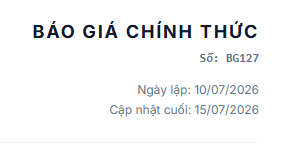
- [X]  khi bắt đầu chạy đang auto đăng nhập trước vào manager
  **Nguyên nhân**: `src/app/auth/login/page.tsx` có `useEffect` tự động điều hướng sang dashboard nếu phát hiện đã có phiên đăng nhập lưu trong `localStorage` (từ lần đăng nhập trước) — mở lại `/` hoặc `/auth/login` sẽ tự nhảy thẳng vào Manager/Admin dashboard, không hiện form đăng nhập.
  **Đã sửa**: xóa hẳn `useEffect` auto-redirect đó — trang login giờ LUÔN hiện form, dù còn phiên cũ hay không, theo đúng yêu cầu. `ProtectedRoute.tsx` (chặn truy cập trang đã bảo vệ khi CHƯA đăng nhập) giữ nguyên, không liên quan.
  Đã kiểm tra: `npx tsc --noEmit` sạch; test Playwright — đăng nhập Manager xong, mở lại `/auth/login` và `/` đều hiện đúng form đăng nhập thay vì tự chuyển hướng. 0 lỗi console.
- [X]  Đổi tên sao cho phù hợp

  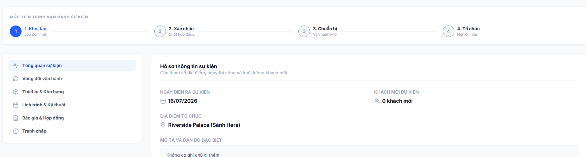
- [X]  Chưa kế thừa dữ liệu (hiển thị ở lựa chọn đơn đặt hàng)

  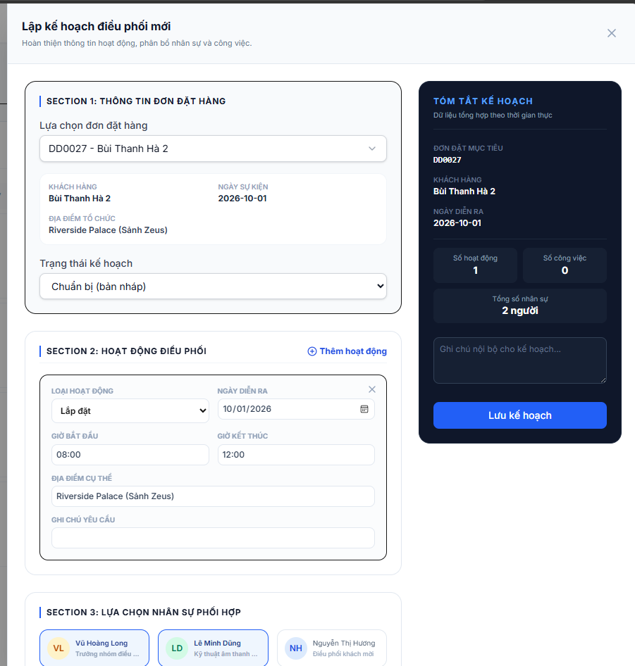
- [X]  chưa cập nhật được trạng thái cọc
  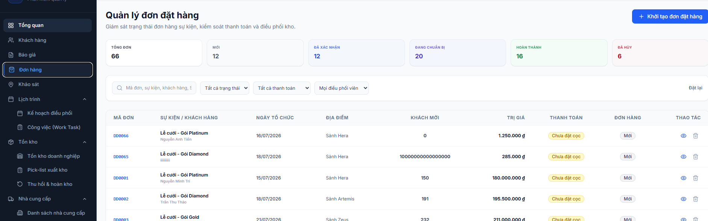
- [X]  Search đc khách hàng

  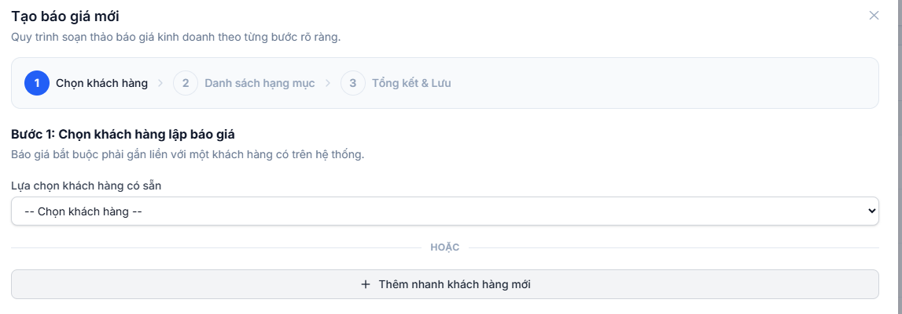
- [X]  thu gọn theo mục và có thể search

  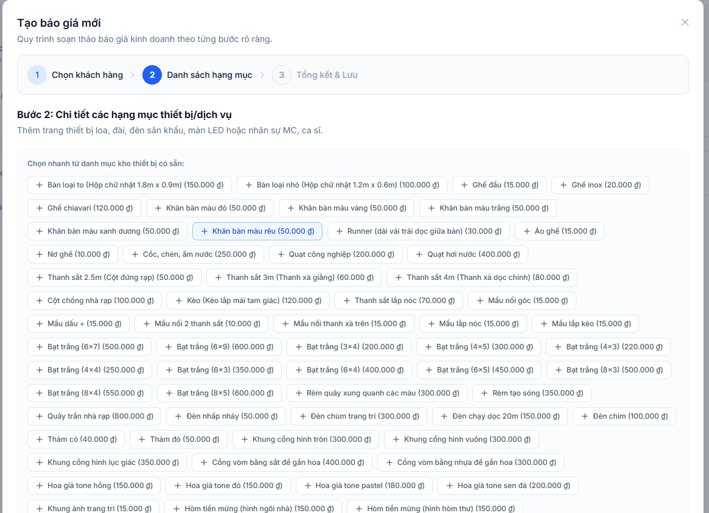
- [X]  khi phân công khảo sát xong phải button " quản lí kế hoạch khảo sát " chuyển thành " đổi lịch phân công" và update kế hoạch lên màn hình
  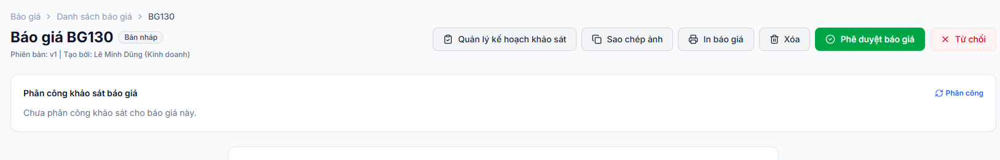
- [X]  xóa phần dự kiến

  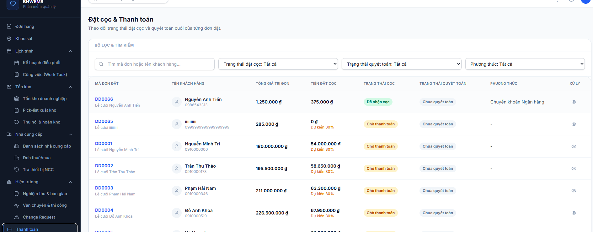
- [X]  xóa cột tiến độ chuânr bị

  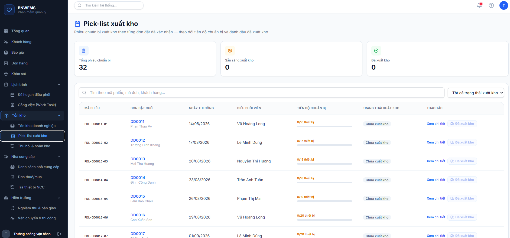
- [X]  Đơn hàng chưa có ngày kết thúc

  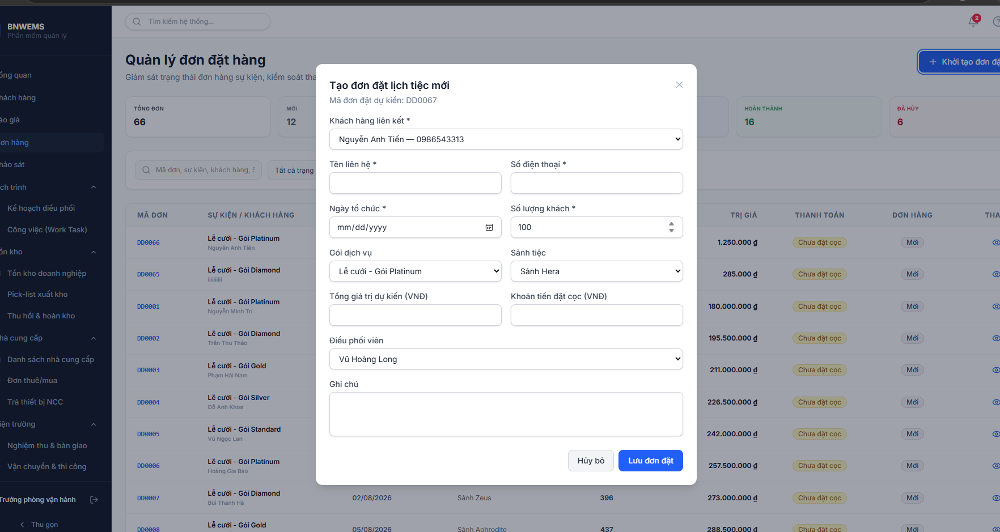
- [X]  Ở mốc 2, Phải xác nhận 2 công việc là cọc vào khảo sát

  những đơn khi khởi tạo mà khách hàng đặt cọc luôn rồi thì xác nhận luôn là đã cọc, những đơn đc tạo khi đã khảo sát và cọc thì xác nhận luôn mốc 2

  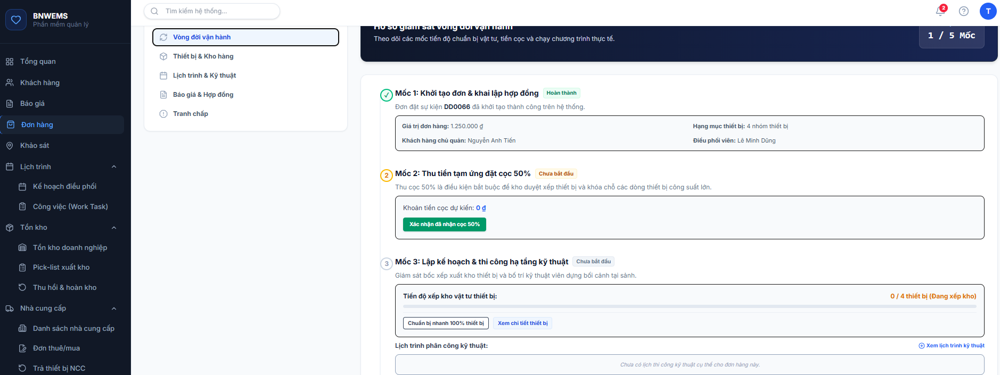
- [X]  Ở mốc 3 có cập nhật trạng thái làm việc ( bắt đầu lúc mấy giờ, hoàn thành lúc mấy giờ) và không có tiến độ sắp xếp kho vật tư

  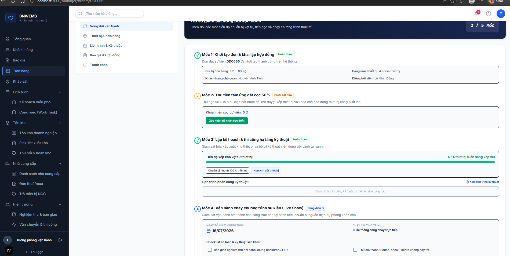
- [X]  Lỗi màn tạo quyết toán trong thanh toán

  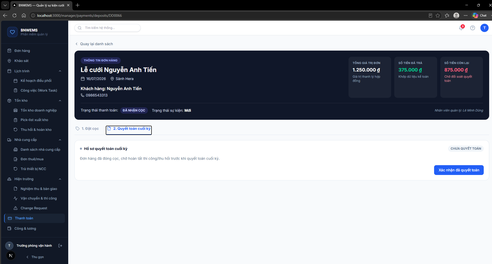
- [X]  nội dung màn change request cũng hiện ở icon chuông trên header

  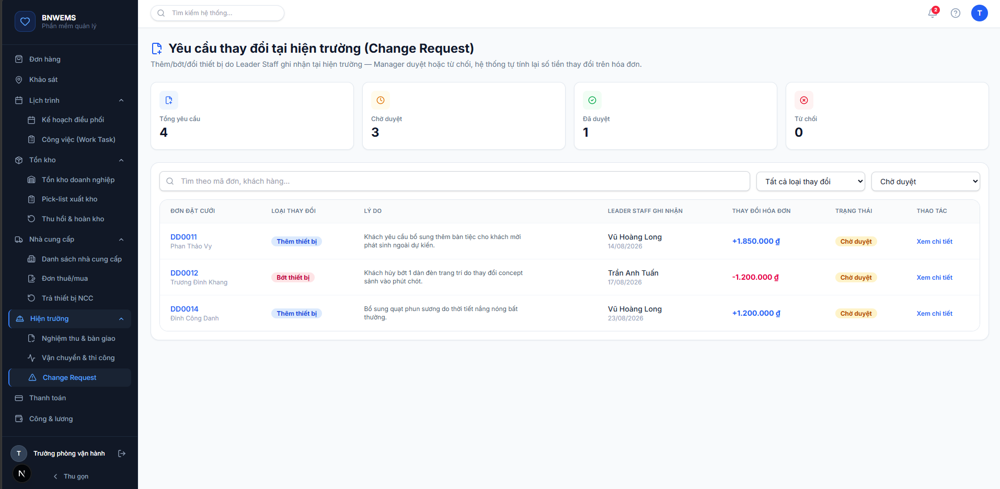
- [X]  Code  thêm màn policy ở admin
- [X]  ở điều khoản chung trong báo giá liên kết với policy trong admin và view nội dung ra
  **Nguyên nhân**: khối "Chính sách chung:" ở trang chi tiết báo giá (`admin/quotations/[id]`, `manager/quotations/[id]`) trước đây là 2 dòng text hard-code cố định ("Báo giá có hiệu lực trong vòng 30 ngày...", "Tạm ứng trước 50%...") — không đọc từ đâu cả, kể cả sau khi đã có màn `/admin/policies` quản lý chính sách thật (task trước đó).
  **Đã sửa** (cả 2 trang, logic giống hệt nhau): import thẳng `MOCK_POLICIES` (`@/mocks/apiFixtures` — cùng nguồn dữ liệu mà `/admin/policies` đọc/ghi qua `policyApiService`), lọc các chính sách **đang áp dụng** thuộc loại `DEPOSIT`/`CANCELLATION` (2 loại liên quan trực tiếp tới điều khoản báo giá — cọc & hoàn cọc khi hủy; `COMPENSATION`/`FEE`/`WAGE` thuộc giai đoạn thi công/vận hành, không phải điều khoản báo giá nên không đưa vào đây) — hiện mỗi chính sách dạng `• {tên chính sách}: {giá trị}{đơn vị} — {mô tả}` (giá trị luôn hiện tường minh, không chỉ dựa vào câu mô tả, vì mô tả tự do không phải lúc nào cũng nhắc lại đúng con số — vd chính sách "Tỉ lệ đặt cọc tiêu chuẩn" có mô tả không hề chứa số %). Dòng "hiệu lực báo giá" đổi từ hard-code "30 ngày" sang hiện đúng ngày hết hạn thật `row.validUntil` của từng báo giá.
  File đã sửa: `src/app/admin/quotations/[id]/page.tsx`, `src/app/manager/quotations/[id]/page.tsx`.
  Đã kiểm tra: `npx tsc --noEmit` sạch; test bằng Playwright (đăng nhập Admin, **điều hướng bằng click thật trong app** — không dùng `page.goto()` giữa các bước vì phát hiện `MOCK_POLICIES` là mảng in-memory thuần như `schedulePlans.ts`, reload cứng sẽ mất thay đổi vừa sửa, không phải lỗi của tính năng) — mở báo giá `bg-1` thấy đúng 4 chính sách thật (3 mốc hoàn cọc + tỉ lệ cọc chuẩn) kèm ngày hết hạn thật; sang `/admin/policies` sửa "Tỉ lệ đặt cọc tiêu chuẩn" từ 50% → 60% → quay lại đúng báo giá `bg-1` bằng điều hướng trong app → **giá trị trên báo giá cập nhật ngay thành 60%**, chứng minh liên kết dữ liệu thật (không phải 2 nguồn tách rời). Đối chiếu thêm phía Manager (`manager/quotations/bg-1`) hiển thị đúng. 0 lỗi console.

  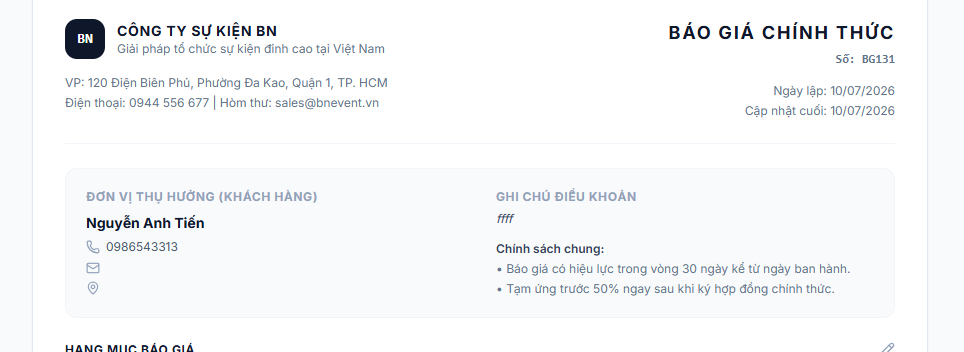
- [X]  Liên kết dữ liệu với mock data, khi click vào thì ra màn của nội dung đấy

  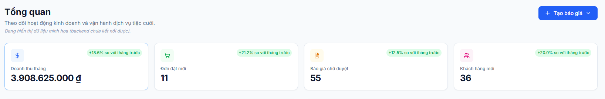
  **Nguyên nhân**: 4 thẻ KPI ở "Tổng quan" Admin (Doanh thu tháng/Đơn đặt mới/Báo giá chờ duyệt/Khách hàng mới) đã tính đúng số liệu thật từ mock data, nhưng thẻ chỉ là `<div>` tĩnh — bấm vào không có phản ứng gì, không dẫn tới màn danh sách tương ứng.
  **Đã sửa**: thêm field `href?: string` vào `KpiCardItem` (`src/components/reports/DashboardStats.tsx`, component KPI dùng chung toàn site) — có `href` thì thẻ tự bọc trong `<Link>` (bấm được, có hover shadow), không có thì giữ nguyên `<div>` tĩnh như cũ (không phá vỡ các nơi khác đang dùng component này mà chưa cần link, vd trang Pick-list xuất kho). Gắn `href` cho từng thẻ:
  - Admin (`admin/dashboard/page.tsx`): Doanh thu tháng → `/admin/reports/revenue`, Đơn đặt mới → `/admin/orders_audit`, Báo giá chờ duyệt → `/admin/quotations`, Khách hàng mới → `/admin/customers`.
  - Manager (`manager/dashboard/page.tsx`, cùng component dùng chung nên sửa luôn cho nhất quán): Đơn đang xử lý → `/manager/orders`, Việc cần làm hôm nay → `/manager/schedule/tasks`, Cảnh báo tồn kho → `/manager/inventory/stock-check`. Riêng "Chờ xác nhận" **không gắn link** — danh sách chi tiết của đúng số liệu này đã hiện sẵn ngay bên dưới trên cùng trang (`PendingConfirmationsCard`), gắn thêm link ra trang khác sẽ dư thừa/gây nhầm.
  File đã sửa: `src/components/reports/DashboardStats.tsx`, `src/app/admin/dashboard/page.tsx`, `src/app/manager/dashboard/page.tsx`.
  Đã kiểm tra: `npx tsc --noEmit` sạch; test bằng Playwright (đăng nhập Admin + Manager riêng biệt, không chỉ đọc code) — xác nhận cả 4 thẻ Admin và 3/4 thẻ Manager có đúng `href` như thiết kế; bấm thật vào thẻ "Đơn đặt mới" → điều hướng đúng sang `/admin/orders_audit`; xác nhận thẻ "Chờ xác nhận" bên Manager **không** phải link (đúng chủ đích). 0 lỗi console.

---

## 3. Mẫu Prompt Tiếp Theo (copy-paste cho thành viên trong nhóm)

```
Đọc file DEMO_CHECKLIST.md ở thư mục gốc dự án. Tìm task đầu tiên trong mục "Còn lại" chưa
được tick [x], thực hiện đúng task đó (chỉ task đó, không làm thêm task khác trừ khi tôi yêu cầu).
Sau khi làm xong và đã tự kiểm tra (chạy npx tsc --noEmit, thử lại trên trình duyệt tại
localhost:3000 nếu liên quan tới UI), cập nhật lại DEMO_CHECKLIST.md: tick [x] task vừa xong,
di chuyển nó xuống mục "Đã hoàn thành" kèm 1 dòng ghi chú ngắn gọn về file đã sửa/kết quả, và
nếu phát hiện lỗi mới trong lúc test thì ghi vào mục "2. Nhật ký lỗi phát hiện khi demo".
Tuân thủ đúng các quy tắc trong CLAUDE.md (đặc biệt mục 0 — giai đoạn dựng giao diện thuần,
mục 4 — quy tắc bắt buộc). Không tự ý commit/push. Báo cáo lại ngắn gọn sau khi xong.
```
